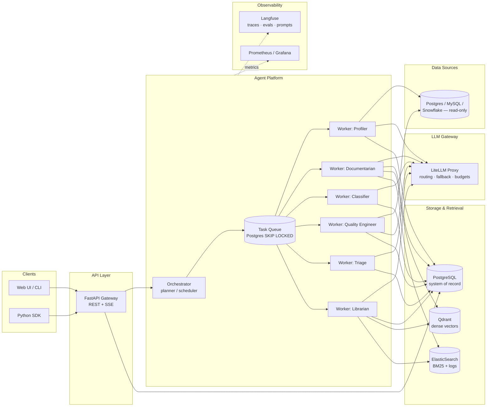

# Steward — Technical Specification

**Version:** 0.2 · **Status:** Draft for implementation · **Last updated:** 2026-08-08

Companion documents: `ARCHITECTURE.md` (requirements, invariants, tech decisions — the authority), `GUARDRAILS.md` (fitness functions enforcing them). This spec details the component designs.

Steward is a multi-agent data management platform. It connects to an organization's databases and autonomously performs four jobs that data teams do manually today:

1. **Catalog & document** — profile every table/column and generate a living, searchable data catalog
2. **Classify** — detect and label sensitive data (PII, PHI, financial) with evidence and confidence
3. **Monitor quality** — propose, compile, and schedule data quality checks; detect schema drift and anomalies; open triaged incidents
4. **Answer** — agentic question-answering over the catalog with hybrid retrieval and citations

---

## Table of contents

1. [Goals and non-goals](#1-goals-and-non-goals)
2. [System architecture](#2-system-architecture)
3. [Agent runtime and orchestration](#3-agent-runtime-and-orchestration)
4. [The agents](#4-the-agents)
5. [Retrieval subsystem](#5-retrieval-subsystem)
6. [LLM gateway](#6-llm-gateway)
7. [Data model](#7-data-model)
8. [API surface](#8-api-surface)
9. [Evaluation framework](#9-evaluation-framework)
10. [Observability](#10-observability)
11. [Deployment and delivery](#11-deployment-and-delivery)
12. [Roadmap](#12-roadmap)
13. [Key design decisions](#13-key-design-decisions)

---

## 1. Goals and non-goals

### Goals

- **G1 — Autonomous stewardship.** Given a database connection, the system produces and maintains a documented, classified catalog with no human authoring required (humans review and approve, they don't write).
- **G2 — Trustworthy answers.** Natural-language questions about the data estate are answered with citations to catalog entries and live metadata, never from the model's parametric memory alone.
- **G3 — Measurable quality.** Every LLM-dependent behavior (documentation, classification, retrieval, answering, triage) has an offline eval suite with golden data, and CI blocks regressions.
- **G4 — Production discipline.** Typed tool contracts, resumable orchestration, idempotent workers, tracing on every step, cost budgets, and GitOps delivery. The system is built to be operated, not demoed.
- **G5 — Self-hosted inference, per-task routing.** Every agent runs on OSS models served by the deployment's own vLLM endpoints; model routing is per-task config, and production aliases resolve only to approved endpoints ([I15](./ARCHITECTURE.md#5-invariants)). Hosted providers are a development convenience, not a production fallback.

### Non-goals

- **Not an ETL/orchestration engine.** Steward observes and manages data; it does not move it. No Airflow/Dagster replacement.
- **Not a BI tool.** The `ask` capability answers questions *about* the data estate (metadata, quality, location, lineage), and can run bounded read-only queries for evidence, but dashboarding is out of scope.
- **Not multi-tenant (v1).** Single organization per deployment. The data model is designed so tenancy can be added without schema rewrite (all root entities carry `workspace_id`).
- **Not a write path to source databases.** All source connections are read-only by construction (enforced at the connection-role level, not just application code).

---

## 2. System architecture



### Components

| Component | Responsibility |
|---|---|
| **API Gateway** | FastAPI service. REST for CRUD/queries, Server-Sent Events for streaming agent runs. AuthN via API keys (v1), OIDC (v2). All request/response bodies are Pydantic v2 models shared with the SDK. |
| **Orchestrator** | Decomposes goals ("scan this source") into task DAGs, enqueues tasks, tracks run state, handles retries/timeouts, and checkpoints progress so runs survive worker restarts. |
| **Workers** | Stateless asyncio processes that claim tasks from the queue and execute one agent loop per task. Horizontally scalable; each worker type maps to a K8s Deployment. |
| **LLM Gateway** | A LiteLLM proxy deployment in front of the cluster's vLLM services. Single OpenAI-compatible endpoint for all workers; model routing, fallback chains, rate limiting, and per-run cost budgets live here, not in agent code. Its routing table is validated against the endpoint allowlist at startup — a config resolving off it refuses to boot (§6, I15). |
| **PostgreSQL** | System of record: sources, assets, profiles, classifications, rules, incidents, agent runs, task queue, checkpoints. |
| **Qdrant** | Dense vector index over catalog documents (asset docs, column docs, profile summaries, incident postmortems). |
| **ElasticSearch** | BM25 lexical index over the same corpus (exact identifiers like `cust_acct_id` are lexical problems, not semantic ones) plus structured agent/audit logs. |
| **Langfuse** | Every agent step emits a trace (session → run → task → generation/tool-call spans). Also hosts prompt versions and eval datasets/scores. |

### Shared libraries (monorepo packages)

The repo is a `uv` workspace with independently importable packages — the same "shared SDK across services" discipline used in platform teams:

```
packages/
  steward-schemas/     # Pydantic models: API contracts, tool I/O, events (zero heavy deps)
  steward-queue/       # Postgres task queue: migrations, transactional enqueue, SKIP LOCKED claiming, worker loop
  steward-orchestration/ # Goal registry + deterministic planners: name, input schema, planner, allowed task types, budget
  steward-catalog/     # Deterministic catalog: secret resolution, read-only source inspection, masked profiling, convergent persistence
  steward-agents/      # Agent runtime: owned contracts (tools, budgets, results); LangGraph contained here
  steward-retrieval/   # Hybrid search client: Qdrant + ES + fusion + rerank
  steward-llm/         # Thin LiteLLM client wrapper: typed completions; owns the endpoint allowlist and the startup refusal (I15)
  steward-telemetry/   # Tracing seam: owned Tracer contract, Langfuse contained behind it
  steward-sdk/         # Public Python client for the REST API (generated types + hand-written ergonomics)
services/
  api/                 # FastAPI app
  workers/             # Worker entrypoints (one per agent type)
```

The source connector planned for `services/connectors/` landed in
`packages/steward-catalog` instead (issue #20). A connector is a library the
scan handler calls, not a process anything deploys, and putting it under
`services/` would have made a package import a service — the one direction I4
forbids. `services/` stays as it was: entrypoints only.

---

## 3. Agent runtime and orchestration

The runtime has two layers with different ownership rules (see [D1](#13-key-design-decisions)):

- **Platform layer (owned, framework-free):** task queue, scheduling, budgets, typed tool contracts, result schemas, tracing/audit policy.
- **Agent execution layer (LangGraph, contained):** the per-task stateful graph — checkpointing via LangGraph's Postgres saver, `interrupt()` for human-review gates, streaming. Confined to `packages/steward-agents` internals; no LangGraph type crosses the package boundary (enforced by S1/S2/S5).

### 3.1 Execution model: planner / worker

- A **run** is created from a goal (e.g. `scan_source(source_id)`, `answer(question)`). Goals are registered, one site each, in `steward-orchestration`: name, typed input schema, planner, allowed task types, budget policy, and a sample payload the planner is replanned against to exercise its determinism over a representative payload (issue #37). The API validates the request against that registration before a run row exists — an unknown goal or a payload the schema rejects is problem-details, not a run (issue #19); a planner that expands to zero tasks is rejected the same way, before the run exists, rather than committed as a run nothing can ever finish (issue #37).
- The **planner** (deterministic code for well-known goals; LLM-planned only for `ask` runs) expands the goal into a **task DAG**, and may only name task types its registration allows. Example for `scan_source`:

```
discover_schema ──► profile_table (×N, fan-out per table)
                        ├─► document_table
                        │       └─► index_document
                        └─► classify_columns
                                └─► propose_quality_rules
```

**That DAG is the target shape. Plan-time fan-out is structurally reservable; model-backed fan-out is still blocked** (issue #48, partially landed). Reservation is not accounting: failed attempts, retries and spend before a task reports failure are not debited, so a run with `max_attempts=3` can consume roughly three times its advertised reservation and `runs.used_*` is a **lower bound** on actual consumption. A deterministic fan-out that spends no model budget is safe under reservation alone; a model-consuming one is not, until failed-attempt usage and incremental agent-loop enforcement land.
Until it landed, every planned task carried the *run's* budget, so an N-way
fan-out let a single run spend N times the cap the API published for it (I12) —
which is why `scan_source` shipped as exactly one task (#20, #37). A plan now
**divides** its run's budget instead: each `PlannedTask` declares its own
`RunBudget`, and `GoalRegistration.plan` refuses the whole expansion —
`RunBudgetExceeded`, before a run row or a task row exists — if those declared
caps sum to more than the goal's budget in any dimension. What the API
advertises for a run is therefore what its tasks may spend between them, not
per branch. `scan_source` stays single-task by choice (one round trip already
enumerates a schema, and convergence diffs the whole catalog at once), not by
necessity.

**Profiling (#49) shipped without fanning out, and the reason is worth
recording** because this section predicted otherwise. Reservation makes an
N-way plan *affordable*; it does not make one *knowable*. A planner is a pure
function of its validated params and touches no connection, so a
`profile_source(source_id)` goal cannot enumerate the source's assets at plan
time — it would have to read the catalog, which is exactly what makes a planner
impure and the determinism harness (`tests/test_goals.py`) meaningless. The
other route, a handler enqueuing its own children, skips plan-time reservation
altogether, which is the hole #48 exists to close. So `profile_asset(asset_id)`
plans exactly one task and the *asset* is the unit that carries a budget.

Budget is explicitly **not** the reason, and it is worth being precise since the
paragraph above says a deterministic fan-out is safe under reservation alone.
Profiling is deterministic SQL and spends no model budget, so it is exactly the
case that paragraph permits: were the assets knowable at plan time, fanning out
would be sound today. They are not, and planner purity is a property this
milestone depends on elsewhere (`test_every_registered_planner_is_deterministic`),
so the constraint holds regardless of what #48 landed. What #48's scope does
add is a reason not to *reach* for a workaround: reservation counts each planned
task once and spend on failed or retried attempts is debited nowhere
([D9](#13-key-design-decisions)), so a handler enqueuing its own children would
put an unaccounted tail under one advertised cap. A per-source expansion belongs
with the accounting that can bound it — a planner that may consult the catalog,
or usage carried on the failure path — not with
this slice.

The mechanism is *not* the one this section previously promised (accumulated
`runs.used_*` compared against `runs.budget_*` by the runtime, arriving with the
agent loop). Reservation at planning time is stricter and lands earlier: it
refuses the plan rather than killing a task mid-run, needs no agent loop to
exist, and leaves nothing enqueued to clean up. `runs.used_*` is still the
accounting — the sum of what the run's succeeded tasks reported — and it stays
inside `runs.budget_*` because the reservation bounded the caps and the runtime
fails any task whose reported usage exceeds its own cap. See [D9](#13-key-design-decisions).

- Tasks are rows in Postgres. Workers claim them with `SELECT ... FOR UPDATE SKIP LOCKED`, giving exactly-once *claiming* with at-least-once *execution* — so **every task handler must be idempotent** (all writes are upserts keyed on natural keys; indexing uses deterministic document IDs).
- Task state machine: `pending → claimed → running → (succeeded | failed | dead)`. Failures retry with exponential backoff up to `max_attempts`; `dead` tasks page via alerting and can be replayed.

### 3.2 The agent loop

Each LLM-driven task runs a bounded tool-use loop:

```python
async def run_agent(task: Task, agent: AgentSpec, ctx: RunContext) -> TaskResult:
    graph = compile_graph(agent, ctx)     # LangGraph internals; never exposed past this package
    raw = await graph.ainvoke(
        initial_state(task),
        config=run_config(task.id, agent.limits, ctx),  # thread_id -> Postgres checkpointer,
    )                                                   # Langfuse callback, budget guards
    return TaskResult.model_validate(raw["result"])     # typed at the boundary, always
```

Budget guards, tool validation, and result typing run in *our* node wrappers around every model call and tool call — the framework executes the graph; it does not get to decide policy.

Properties the runtime guarantees:

- **Typed tools.** Every tool is a Python function with Pydantic input/output models; schemas are generated, arguments validated before execution, and validation errors are returned to the model as structured feedback (one retry) rather than crashing the run.
- **Budgets are hard, and they nest.** Per-task caps on steps, tokens, dollars (via LiteLLM cost tracking), and wall-clock, and those caps are *drawn from the run's* — a plan whose tasks reserve more than the run's budget is refused before anything is enqueued ([D9](#13-key-design-decisions)). Exceeding a budget fails the task with a `budget_exceeded` error — visible in traces and metrics — never a silent truncation. Wall-clock is enforced by the worker rather than by the handler honouring it: the handler runs on its own thread and the loop holds the deadline, so the cap binds a handler that awaits, one blocked in the driver, and one blocked in Python alike ([D7](#13-key-design-decisions)). Steps, tokens and cost are counted inside the handler and reported on its result, so they are enforced where they become visible: a succeeded result whose usage exceeds its task's cap is turned into a `budget_exceeded` failure and its usage is never rolled up. In-loop enforcement — stopping an agent at the step that *would* cross the cap — lands with the M1 agent loop; the check on the reported total is the outer fence and holds whatever the loop does.
- **Checkpointing.** Agent state (message history + scratchpad) is persisted after every step. A worker dying mid-run (deploy, OOM, spot eviction) costs at most one step of progress.
- **Structured results.** A task's terminal output must validate against the task type's result schema (the model is forced through a `submit_result` tool). Downstream tasks consume typed results, never prose.
- **Least-privilege toolsets.** Each agent type gets an explicit allowlist of tools. The Classifier cannot run SQL; the Profiler cannot write catalog docs.

### 3.3 Human-in-the-loop gates

Actions with governance weight — publishing PII classifications, activating proposed quality rules — enter a `pending_review` state and surface in a review queue (API + UI). Approval policies are configurable per action type: `auto` (trusted), `auto_above_confidence(x)`, or `manual`. Every auto-approval is auditable back to the policy that allowed it.

---

## 4. The agents

| Agent | Trigger | Input | Tools | Output (typed) |
|---|---|---|---|---|
| **Profiler** | scan, schedule, drift event | table ref | `run_profile_sql` (templated, read-only), `sample_rows` (masked) | `TableProfile`: row counts, per-column stats, null/distinct ratios, top values, inferred semantic types |
| **Documentarian** | new/changed profile | profile + schema + query-log excerpts | `get_related_assets`, `search_catalog`, `submit_doc` | `AssetDoc`: table summary, per-column descriptions, join keys, caveats — each claim tagged with evidence refs |
| **Classifier** | new/changed columns | column metadata + masked value samples | `submit_classification` | `ColumnClassification`: label (PII.email, PII.national_id, PHI, financial, none…), confidence, evidence spans, suggested policy tag |
| **Quality Engineer** | post-documentation, user request | profile + doc + history | `compile_rule_sql`, `dry_run_rule`, `submit_rules` | `QualityRuleSet`: declarative expectations (not-null, unique, range, freshness, referential, distribution-drift) with rationale |
| **Triage** | check failure / drift detection | failing check + profile history + recent schema changes + related incidents | `get_check_history`, `diff_schemas`, `search_incidents`, `submit_triage` | `IncidentTriage`: severity, blast-radius (downstream assets), ranked root-cause hypotheses, suggested owner |
| **Librarian** | `POST /v1/ask` | user question | `search_catalog` (hybrid), `get_asset`, `get_profile`, `run_readonly_sql` (bounded: LIMIT-enforced, cost-capped, masked), `submit_answer` | `Answer`: markdown answer with inline citations `[asset:123]`, confidence, and the retrieval trail |

Two design rules apply across all agents:

1. **Evidence or it didn't happen.** Documentarian, Classifier, and Librarian outputs must reference evidence (profile fields, sampled values, retrieved documents). Unsupported claims fail schema validation.
2. **Sensitive values never reach the model raw.** Sampling tools apply format-preserving masking (`j***@g***.***`, `****-****-****-****`) before values enter a prompt; classification works from formats, names, and statistics, not raw payloads. **Landed with #49**, as a type rather than a convention: a value read out of a source is a `RawCell`, which is not a `str` and satisfies no parameter typed for data, and the only function that reads one returns a `MaskedSample` — which is what every value-carrying field of a profile is declared as. The rule is therefore checked by `mypy --strict` (G2) and watched end to end by H7 ([D10](#13-key-design-decisions)).

---

## 5. Retrieval subsystem

The catalog corpus (asset docs, column docs, profile summaries, quality rules, incident postmortems) is indexed twice and searched once.

### 5.1 Indexing pipeline

- **Chunking:** documents are chunked structurally (a column doc is one chunk; a table doc chunks by section), never by fixed token windows — catalog documents have meaningful structure, and chunk boundaries should follow it.
- **Dense:** embeddings via the LLM gateway (`steward-embed` → `bge-m3` on the deployment's own vLLM; a hosted embedder is a development-mode choice only, I15). Stored in Qdrant with payload filters: `asset_type`, `source_id`, `sensitivity`, `updated_at`.
- **Lexical:** the same chunks go to ElasticSearch with custom analyzers that preserve identifiers (`cust_acct_id` tokenizes to `cust_acct_id`, `cust`, `acct`, `id`) — users search by exact column names as often as by meaning.
- **Consistency:** indexing is an orchestrated task downstream of doc generation with deterministic doc IDs, so re-runs converge. A nightly reconciliation job diffs Postgres (truth) against both indexes and repairs drift.

### 5.2 Query pipeline

```
question ──► query analysis ──► parallel: Qdrant top-40 (filtered)
                    │                     ES BM25 top-40 (filtered)
                    │                        │
                    └────────► RRF fusion ◄──┘
                                   │
                            cross-encoder rerank → top-8
                                   │
                            context assembly (dedup by asset, freshness-boosted)
```

- **Query analysis** (small/fast model): extracts filters (source, sensitivity, asset type) and rewrites the question into one semantic query + zero or more lexical identifier queries.
- **Fusion:** reciprocal-rank fusion (k=60) — robust to score-scale mismatch between engines, no tuning burden.
- **Rerank:** cross-encoder (`bge-reranker-v2-m3` on vLLM) over the fused top-40. It reaches the gateway as a `steward-rerank` alias, which joins §6's table — and therefore the startup check's required set — when retrieval lands in M2.
- **Agentic search:** the Librarian doesn't get one shot. It can reformulate and re-search, drill into specific assets, and run bounded verification SQL — the retrieval trail is captured in the trace and returned with the answer.

### 5.3 Retrieval quality targets (eval-gated, see §9)

| Metric | Target |
|---|---|
| Recall@8 (golden query set) | ≥ 0.90 |
| MRR@8 | ≥ 0.75 |
| P95 search latency (no rerank / with rerank) | ≤ 150 ms / ≤ 400 ms |

---

## 6. LLM gateway

All model access goes through a **LiteLLM proxy** deployment. Agent code sees one OpenAI-compatible endpoint and *model aliases*, never provider SDKs.

**Production inference is self-hosted, and that is enforced at runtime.** Every production alias binds to a vLLM endpoint on the deployment's allowlist; the gateway config is validated when a process starts, and a process whose config resolves anywhere else does not start ([I15](./ARCHITECTURE.md#5-invariants), [D8](#13-key-design-decisions)). Hosted providers appear only under `STEWARD_DEPLOYMENT_MODE=development` — a mode that must be selected by name, since production is what an unset variable means.

### Routing by task tier

| Alias | Used for | Production binding (self-hosted) | Redundancy | Development-only alternative |
|---|---|---|---|---|
| `steward-reasoning` | Documentarian, Triage, Librarian planning | `hosted_vllm/qwen3-32b-instruct` | two endpoints (`-a`/`-b`) | `claude-sonnet-*` / `gpt-5.x` — dev mode, never production |
| `steward-fast` | query analysis, rule compilation, extraction | `hosted_vllm/qwen3-8b-instruct` | two endpoints | `claude-haiku-*` — dev mode, never production |
| `steward-classify` | Classifier | `hosted_vllm/qwen3-7b-classify` (fine-tune-ready) | two endpoints, then `steward-fast` | — |
| `steward-embed` | embeddings | `hosted_vllm/bge-m3` | two endpoints | `text-embedding-3-large` — dev mode, never production |

The committed routing table is `packages/steward-llm/src/steward_llm/defaults/litellm.production.yaml`, checked on every commit by S9; the endpoints it may name are `approved_endpoints.yaml`, which a deployment overrides wholesale via `STEWARD_LLM_APPROVED_ENDPOINTS`.

**Fallback chains stay inside the allowlist.** Losing hosted providers means losing the fallback that used to answer "what if a model is unavailable", so each alias is served by two approved endpoints and LiteLLM routes around a failed one — redundancy replaces provider diversity (D8). An alias may fall back to another alias; it may never fall back out of the deployment.

**Callers reach it through `steward_llm.LLMClient`**, which is constructed from a validated `GatewayConfig` and addresses models by alias, returning owned request/result models — tokens, cost as `Decimal`, latency, alias, prompt version — and raising owned errors that carry the usage a failed call already spent. How a worker addresses the proxy process itself is not yet decided (a `GatewayConfig` is the proxy's routing table, not its address), so the client reaches models through a transport seam whose only implementation today is a deterministic stub — [D12](#13-key-design-decisions).

The gateway also owns: per-workspace **cost budgets** (hard caps surfaced as 429s to workers, which pause runs rather than degrade silently), **response caching** for idempotent calls (profiling summaries, embeddings), **retry/fallback** policy, and **key management**. Changing which approved endpoint or OSS model an alias uses is a values-file change, not a code change (**G5**); leaving the approved set is a `GUARDRAILS.md` §7 amendment.

---

## 7. Data model

PostgreSQL is the single system of record. Qdrant/ES are derived indexes, rebuildable from Postgres at any time. Core entities (all tables carry `workspace_id`, timestamps; migrations via Alembic):

```
sources          — connection registrations (dsn ref → secret store, engine, scan schedule)
assets           — tables/views discovered in sources (fqn, type, lifecycle: active|missing|deprecated)
columns          — per-asset columns (name, type, ordinal, nullable)
profiles         — versioned TableProfile JSONB per asset (append-only; latest pointer)
documents        — versioned catalog docs (asset/column level, markdown + evidence refs, review state)
classifications  — column sensitivity labels (label, confidence, evidence, review state, policy tag)
quality_rules    — declarative expectations (type, params, compiled SQL, state: proposed|active|muted)
check_runs       — rule execution results (pass/fail, observed values, duration)
incidents        — opened from failures/drift (severity, status, triage JSONB, links to check_runs)
runs             — agent run records (goal, payload, status, budget + usage, langfuse trace id, idempotency key)
tasks            — the queue (run_id, type, payload JSONB, state, attempts, claimed_by, …)
checkpoints      — agent state snapshots (task_id, step, state JSONB)
audit_log        — every state-changing action (actor: human|agent|policy, before/after)
```

The catalog half of that list landed with issue #20 and carries three schema-level
guarantees worth naming. `sources` is unique on (workspace, engine, host,
database, schema filter), `assets` on (source, schema, name) and `columns` on
(asset, name), so re-registering a source or rescanning a database converges on
the existing row rather than duplicating it (I8). `sources.dsn_secret_ref` has a
CHECK admitting `scheme:name` references only — every DSN shape fails it — so a
credential cannot be written to the database at all (N7). And there is no
`last_seen_at`: a timestamp touched by every scan would make "a rescan with no
upstream change leaves byte-identical state" false by construction. What was
seen when is what `audit_log` records.

`profiles` landed with issue #49 and carries two guarantees of its own.
`(asset_id, version)` is unique, so two profilers racing on one asset cannot
both write version 4 — the history is a total order rather than a fork — and
the row carries the **digest** of the `TableProfile` it holds, which is what
makes re-profiling converge: a computed profile whose digest equals the latest
stored one is not written at all, so an append-only table does not grow a row
per scheduled profile of a table nobody has touched (I8, the same property
`plan_convergence` gives a rescan). The profile itself is JSONB, so what a
profile *says* can grow — #50's classification evidence, #51's documentation
hooks — without a migration, while the row around it stays fixed. There is no
`UPDATE` or `DELETE` statement for the table anywhere in the codebase. Every
value inside the JSONB is a `MaskedSample`, and how much a mask must conceal is
stated once, in `masking._required_concealment` ([D10](#13-key-design-decisions))
rather than in prose that drifts from it — so this table holds shapes and
statistics rather than customer values (I6).

Notable choices: profiles and documents are **append-only versioned** (stewardship history is a feature — "what did this table look like in March?"); the task queue lives in Postgres rather than a broker (see [D2](#13-key-design-decisions)); `audit_log` is written from the same transactions as the mutations they record; `runs.trace_id` is `NOT NULL` and `runs.idempotency_key` is uniquely indexed, so an untraceable run and a duplicated `POST /v1/runs` are both unrepresentable rather than merely discouraged.

---

## 8. API surface

REST, versioned under `/v1`, OpenAPI-first (the spec is generated from code and published; the SDK's types are generated from the spec — one source of truth).

```
# Sources & scanning
POST   /v1/sources                       # register a source (read-only DSN)
POST   /v1/sources/{id}/scan             # start a scan run → 202 + run_id
GET    /v1/sources/{id}/assets

# Catalog
GET    /v1/assets?query=&source=&sensitivity=
GET    /v1/assets/{id}                   # doc + profile + classifications + rules
GET    /v1/assets/{id}/history

# Search & ask
POST   /v1/search                        # hybrid retrieval, returns ranked chunks + scores
POST   /v1/ask                           # agentic QA; SSE stream: retrieval events → tokens → citations

# Quality
GET    /v1/quality/rules?asset_id=&state=
POST   /v1/quality/rules/{id}:activate | :mute
GET    /v1/incidents?status=&severity=
POST   /v1/incidents/{id}:resolve

# Review queue (human-in-the-loop)
GET    /v1/reviews?type=classification|document|rule
POST   /v1/reviews/{id}:approve | :reject     # rejection requires a reason → becomes eval data

# Runs & operations
POST   /v1/runs                          # M0 skeleton: generic goal-based run creation → 202 + run_id
GET    /v1/runs/{id}                     # status, task tree, cost, trace link
POST   /v1/runs/{id}:cancel
```

`POST /v1/sources` is idempotent on the source's natural key and answers 201 the
first time, 200 on a repeat, so a client can tell whether it created anything
without a second request. `POST /v1/sources/{id}/scan` answers 202 either way:
if a scan of that source is already pending or running it returns that run
rather than starting a second, decided under a transaction-scoped advisory lock
so two simultaneous requests serialise instead of both starting one. When the
request also carries an `Idempotency-Key` that is unbound so far, the key is
bound to whichever run answers it — the one just created, or the one
single-flight found already in flight — so a later replay of the same key
converges on that run even after it finishes, instead of the key going
unbound while a scan is in flight and a later replay starting a second one
(issue #44). A key already bound to a run of a *different* goal or source is a
`409` on this endpoint the same as it is on `POST /v1/runs`, including when
the request that names the wrong source is itself answered by single-flight.
A run remembers one key, so binding can itself fail: if single-flight answers
a request with a run that already carries a *different* key (a second,
independent retry racing its own key against a run someone else's request
started), the new key cannot be attached and the endpoint says so with a
`409` rather than a `202` it could not keep a promise about (issue #47) —
distinguished from the cross-source `409` by `type`
(`urn:steward:idempotency-key-unbindable` vs
`urn:steward:idempotency-key-reused`). Nothing is written for a key that
fails to bind: it is rejected, not recorded, so a later request carrying it
once nothing is in flight is indistinguishable from an unkeyed request and is
free to start a new scan — the one case here where a key does not guarantee
convergence, stated as a fact of this schema (one key per run) rather than
left for a client to discover by retrying.
`GET /v1/assets` pages by opaque cursor over `(schema, name, id)` — a total
order, so a scan committing between two pages cannot make a client skip an asset.

`POST /v1/runs` is M0's entry point: a generic `{goal, payload}` body returning 202. The run row and the tasks its goal plans are written in one transaction (I8), so a 202 is a guarantee that work is queued, not a promise to queue it later; a worker then executes the task and the run's status follows its tasks (`pending → running → succeeded|failed`) in the transaction that settles the last one. The expansion is the goal registry's (§3.1): the endpoint validates `goal` and `payload` against the registration and rejects anything unregistered or schema-invalid with problem details before a run exists (#19). Goal-specific endpoints (`POST /v1/sources/{id}/scan`, above) land in M1 and are expected to become the primary way runs get created; whether `POST /v1/runs` stays as a generic escape hatch or narrows to goal-specific endpoints only is an open question for that milestone.

The published run contract is a **projection**, not the row: `Run` (id, goal, payload, status, trace id, budget, usage, timestamps) is built from the `runs` record by the API service, so storage can change without that being an API change (I3, N9). Every run carries a Langfuse trace id from creation, generated locally and stored on the row whether or not tracing credentials are configured — so a run is always correlatable and no deployment depends on an observability account to function (I7).

Conventions: cursor pagination everywhere; RFC 9457 problem-details errors; idempotency keys on all POSTs that create runs — replayed with the same body they return the original run, replayed with a different one they are a `409`, because returning the original would tell a client its edited request was queued when nothing will ever run it; on an endpoint where single-flight can also answer the request (`POST /v1/sources/{id}/scan`, above), a same-body key can additionally fail to *bind* rather than mismatch, which is its own `409` rather than either of the first two outcomes; SSE (not WebSockets) for streaming — it's proxy-friendly and resumable via `Last-Event-ID`.

**Rejections are eval data:** every human rejection in the review queue (with reason) is exported to a Langfuse dataset, closing the loop between production feedback and offline evals.

---

## 9. Evaluation framework

The eval framework is a first-class subsystem, not an afterthought: **no prompt, model binding, or retrieval parameter changes ship without passing the eval gate in CI.**

### 9.1 Eval suites

| Suite | Dataset | Method | Gate |
|---|---|---|---|
| **Retrieval** | ~200 golden queries → relevant asset IDs (seeded from synthetic questions over a fixture warehouse, grown from real `ask` traffic) | deterministic: recall@k, MRR, nDCG | recall@8 ≥ 0.90, no metric drops > 2 pts vs `main` |
| **Classification** | labeled fixture columns (each sensitivity type × tricky negatives: `ssn_hash`, `email_domain`, test data) | deterministic: precision/recall per label | PII recall ≥ 0.95, precision ≥ 0.90 |
| **Documentation** | fixture tables with reference docs | LLM-as-judge, rubric-scored (accuracy, completeness, evidence-grounding, concision), judge calibrated against a human-scored subset (target: Cohen's κ ≥ 0.7, recalibrate when it drifts) | mean ≥ 4.0/5, zero ungrounded-claim flags |
| **Answering** | golden Q&A pairs over the fixture warehouse | faithfulness (every claim cites retrieved evidence — judge-scored) + answer correctness | faithfulness ≥ 0.95 |
| **Triage** | replayed historical incidents with known root causes | root-cause hit@3, severity agreement | hit@3 ≥ 0.8 |
| **Agent efficiency** | all suites | steps, tokens, cost per task | cost per task ≤ 1.2× baseline |

### 9.2 Mechanics

- Datasets and scores live in **Langfuse**; runs execute via `steward evals run <suite>` against a Dockerized fixture warehouse (deterministic seed data), so evals run identically on a laptop and in CI.
- **CI gate:** PRs touching prompts, agent specs, retrieval config, or model bindings trigger the affected suites in GitHub Actions; results are posted as a PR comment with per-metric deltas vs `main`.
- **Online:** sampled production runs (10%) are judge-scored asynchronously; scores land in Langfuse and Prometheus, alerting on degradation — the canary for silent model-behavior changes.

---

## 10. Observability

Three layers, distinct jobs:

1. **Langfuse — semantic tracing.** Every run is a trace; every task, generation, and tool call is a span with model, tokens, cost, latency, and validated I/O. Prompt versions are managed in Langfuse, so any output links to the exact prompt version that produced it. Answering "why did the Classifier call this column PHI?" is a trace lookup, not archaeology. Langfuse is reached only through `steward-telemetry`'s owned `Tracer` contract (the same containment pattern as LangGraph and LiteLLM), and the trace id is generated locally: with no credentials configured the system runs unchanged and only span export is missing.
2. **OpenTelemetry + Prometheus/Grafana — service health.** RED metrics for the API, queue depth/age per task type, worker saturation, per-alias LLM latency/error/fallback rates, cost per workspace per day. SLOs: API P99 < 500 ms (non-agent endpoints); scan completes < 30 min for a 500-table source; `ask` P50 < 10 s.
3. **ElasticSearch — structured logs.** JSON logs correlated by `run_id`/`task_id`/`trace_id`, searchable next to the audit trail.

Alerting is defined in code (Prometheus rules in the Helm chart): dead tasks, queue age > 10 min, eval-score degradation, budget-cap hits, fallback-chain activation, index-reconciliation drift.

---

## 11. Deployment and delivery

### Runtime topology (Kubernetes)

- `api` Deployment (HPA on CPU/RPS) · one Deployment per worker type (HPA on queue depth via KEDA-style custom metric) · `litellm` Deployment · CronJobs for scheduled scans, check execution, and index reconciliation.
- Postgres/Qdrant/ES via operators or managed services (values-file choice); Langfuse self-hosted in-cluster or cloud.
- Config via Helm values; secrets via ExternalSecrets (source DSNs and endpoint keys never in git); NetworkPolicies restrict workers so only connector pods can reach data sources, and restrict egress from worker and `litellm` pods to the approved inference endpoints — the network-level half of I15, which is what binds a process that never goes through our code (M6, issue #59).

### CI/CD

- **CI (GitHub Actions):** lint (`ruff`), types (`mypy --strict` on `packages/` and `services/`), tests (`pytest`, unit + integration against Dockerized Postgres/Qdrant/ES), eval gates (§9), image build/scan, Helm chart lint. Trunk-based; merge queue.
- **CD (ArgoCD):** GitOps repo holds environment overlays (`dev` → `staging` → `prod`). CI bumps image tags in `dev` automatically; promotion is a PR between overlay directories. Argo Rollouts canaries the API (10% → analysis against error-rate/latency metrics → 100%); prompt/model-binding changes ride the same pipeline as code — **a bad prompt is rolled back exactly like a bad image**.

---

## 12. Roadmap

| Milestone | Scope | Exit criterion |
|---|---|---|
| **M0 — Skeleton** | uv workspace, schemas package, FastAPI app, Postgres migrations, task queue + worker loop (no LLM), CI green | a no-op run flows API → queue → worker → done under **end-to-end trace correlation**: one trace id, generated locally and stored NOT NULL, carried from the POST response through every span and audit row. Verifying that Langfuse *received* a resolvable trace is H6, and lands with the M1 agent loop — M0 deliberately runs credential-free |
| **M1 — Catalog** | Postgres connector, Profiler, Documentarian, Classifier; review queue; audit log | scan of the fixture warehouse (100+ tables) yields reviewed docs + classifications |
| **M2 — Search** | indexing pipeline, hybrid retrieval, `/v1/search`; retrieval eval suite gating CI | retrieval targets met on golden set |
| **M3 — Ask** | Librarian agent, SSE streaming, citations; answering eval suite | faithfulness ≥ 0.95 on golden Q&A |
| **M4 — Quality** | Quality Engineer, rule compiler/scheduler, drift detection, Triage, incidents | injected data faults in fixtures are detected and correctly triaged |
| **M5 — Hardening** | budgets, checkpointing under chaos testing (kill workers mid-run), online eval sampling, dashboards, alerting | chaos suite passes; SLO dashboards live |
| **M6 — Delivery** | Helm chart, ArgoCD overlays, canary rollouts, load test (500-table scan; 50 concurrent asks) | one-command deploy to a fresh cluster meets SLOs |

Post-v1 candidates: lineage extraction from query logs, dbt/warehouse-native connectors (Snowflake, BigQuery), knowledge-graph layer over the catalog, MCP server exposing Steward tools to external agents, multi-tenancy.

---

## 13. Key design decisions

**D1 — LangGraph for agent execution, contained behind an owned contract.**
The runtime splits into two layers with different ownership rules. **Agent execution** — the stateful graph, checkpointing, interrupt/resume, streaming — runs on LangGraph: its Postgres checkpointer aligns with I1, `interrupt()` maps directly to our human-review gates, Langfuse integrates natively, and rebuilding durable execution is weeks of undifferentiated work. **The platform contract** — typed tools, budgets, task claiming, result schemas, tracing policy — is ours and framework-free. Containment is mechanical, not aspirational: `langgraph` imports are allowed only inside `packages/steward-agents` (S1), and no LangGraph type appears in that package's public API (S5) — callers see our Pydantic contracts only. If LangGraph churns or a better substrate appears, the blast radius is one package's internals.
Rejected: *fully custom runtime* — re-derives checkpointing/interrupts/streaming for no differentiating value, and an unfinished runtime is worse than a contained dependency; *whole-hog LangChain adoption* (chains, community integrations threaded through business code) — that coupling is exactly what I9 exists to prevent; *CrewAI/AutoGen-style frameworks* — opinionated multi-agent abstractions that would own our orchestration semantics instead of the reverse. (LiteLLM in `steward-llm` follows the same containment pattern for providers.)

**D2 — Postgres as the task queue (SKIP LOCKED), not Redis/RabbitMQ/Kafka.**
Task throughput is modest (thousands/hour, not millions/sec); what matters is **transactional enqueue** — a task and the state change that caused it commit atomically, eliminating a whole class of ghost-task/lost-task bugs. One fewer stateful system to operate. The queue interface is abstracted so a broker can replace it if throughput ever demands.

**D3 — Hybrid retrieval from day one, not dense-only.**
Data-estate search is bimodal: "where is churn data?" is semantic; `cust_acct_id` is lexical. Dense-only retrieval measurably fails the second mode. RRF fusion is scale-free and tuning-free, and ElasticSearch is already in the stack for logs.

**D4 — Evidence-required outputs, enforced by schema.**
Hallucinated column descriptions are worse than none — they erode the trust the whole product depends on. Requiring evidence references in the output schema (validation-enforced, judge-audited) turns "the model shouldn't make things up" from a hope into a contract.

**D5 — SQL access is templated for agents, free-form only for the Librarian — and always bounded.**
Profiler/Quality agents execute *parameterized templates* (no injection surface, predictable cost). Only the Librarian composes SQL, and only through a tool that enforces read-only role, `LIMIT`, statement timeout, cost estimation, and value masking. Capability, then containment.

**D6 — Prompts are deployable artifacts.**
Prompts are versioned in Langfuse, referenced by version in config, changed via PR, gated by evals, and rolled back via ArgoCD like any binary. "Someone edited the prompt in prod" must be structurally impossible.

**D7 — Task handlers run on a thread of their own, through a connection of their own; the loop holds the deadline.**
A handler is executed on a dedicated thread that opens its own Postgres connection, uses it, and closes it there. The worker's event loop keeps a second connection for its own bookkeeping and never sees the handler's; the only thing that crosses the thread boundary is the handler backend's **pid**, an integer. Enforcement is layered: the thread runs the handler under an in-thread `asyncio.timeout(cap)` and a `statement_timeout = cap`, so an awaiting handler and a driver-blocked one both come back at the cap and record `budget_exceeded` atomically with whatever they wrote; `DEADLINE_GRACE` (500 ms) past the cap the loop stops waiting, has Postgres **terminate** the handler's session by pid, and records the failure itself. A `Handoff` mutex decides which of the two records the attempt, so **at most one** of them records it and the loser writes nothing at all — at most, not exactly, and the gap is stated below.

*What this buys.* The guaranteed margin is `DEADLINE_GRACE` + one terminate round trip + one bookkeeping transaction — independent of what the handler is doing, because nothing on the enforcement path waits on the handler thread. The loop stays free, so `reap_stale` and SIGTERM are bounded by a poll interval instead of a task duration (N1). And the safety property is structural: two contexts cannot touch one connection because neither can name the other's, and the abandoned session is destroyed rather than trusted — an abandoned handler is not *expected* not to write, it *cannot*.

*What it costs.* Handler writes no longer share a transaction with `mark_running` (they never did) but they still share one with the terminal state and the audit row, which is the property I7/I8 needs. A worker asked to stop mid-handler takes the handoff, drops the handler's session and abandons the attempt to its lease, so shutdown costs one re-executed idempotent attempt — exactly N1's model. A thread blocked on a *third-party* socket (a customer database) still cannot be killed; it is bounded by the budget-derived `connect_timeout`/`statement_timeout` the connector sets, and its work is discarded either way. Such threads are not counted, only bounded: a worker claims `batch_size` tasks at a time and executes them in turn, so the number alive at once is the abandonment rate times that lifetime, not the queue depth. A worker whose sources routinely hang should be given a tighter budget, not a thread pool.

*How a failure is named, and what naming it costs.* Three titles come out of an execution and they send an operator to three different places: `budget_exceeded` (the cap), `handler raised` (the task's own code), `execution failed` (the machinery around it — typically the connection the handler needs). `budget_exceeded` is reached two ways, one per shape that can produce an overrun: a private `_WallClockExpired` that `_bounded` raises only when the timeout *it* set fired, and, for the driver-blocked shape whose overrun arrives as an ordinary `QueryCanceled`, the clock — `elapsed >= cap`. What it is *not* reached by any more is `isinstance(exc, TimeoutError)`, which since 3.11 is also `socket.timeout`: a customer database's `connect_timeout` firing five seconds into a half-hour budget recorded `budget_exceeded` against a cap nothing had approached, sending the operator to the budget instead of the unreachable host and leaving H4's assertion satisfiable by a non-budget failure (#57). Narrowing to the sentinel was preferred to the clock test alone because it names the mechanism rather than inferring it from arithmetic against a deadline the event loop is entitled to fire fractionally early; the clock test stays, because the driver-blocked shape has no in-band signal to narrow to. Which of the other two a raise gets is decided by **the frame it came out of, not the class it inherits from**: what the handler raised is the handler's (`handler raised`), what the code around it raised is the machinery's (`execution failed`). That used to be true only for `Exception`s — a handler raising a `BaseException` subclass, which is how some libraries spell a fatal error, fell past the handler's own catch into the thread entry point and was filed `execution failed`, sending an operator to the connection when the bug was in the task (#63).

**The fatal set is empty (#63).** Nothing raised on the handler thread travels out of the worker, because a thread has nothing to say about a process. `SystemExit` on a non-main thread ends *that thread* under Python's threading semantics and nothing else, so escalating it to a worker exit manufactured a process death the interpreter would not perform — and a handler whose dependency calls `sys.exit()` on a fail-fast path (argparse/click style, or a library hard-fail) is exactly the #55 shape through the one door #55 left named, to which #55's own reasoning applies verbatim. `KeyboardInterrupt` cannot be *delivered* to a handler thread at all — the interpreter raises it on the main thread — so one arriving there can only be an explicit raise by the code running there: a task's bug wearing a shutdown's name. The pair therefore read narrower in a thread than they read on the page, which is why naming them was never the same as naming the process ending. `asyncio.CancelledError` had already left the set for a neighbouring reason: the handler runs `asyncio.run` on a loop of its own, so a `CancelledError` escaping it — an inner `wait_for` or `TaskGroup` a handler leaked, a routine bug the moment handlers await the gateway — is one task's failure and killed the worker instead (#55).

*What happens to a real shutdown,* which never came through this door: `services/workers` wires SIGINT and SIGTERM to the loop's stop event, the worker stops waiting within a poll interval, takes the handoff, drops the handler's session and leaves the attempt to its lease (N1) — the path H4 already asserts. Where `add_signal_handler` is unavailable, a `KeyboardInterrupt` still lands on the main thread, where the loop runs, and ends the process from there. Handler threads are daemons, so an abandoned one cannot hold a dying process open either way. What is lost is a worker that exited when a handler's dependency asked the *process* to exit; that request is now recorded as the failure of the task that made it, which is the only scope it was ever entitled to.

**The trade in the other direction is real:** `MemoryError` and an fd-exhausted `OSError` *are* `Exception`s, so a degraded worker now files them as its task's failure, consumes an attempt with backoff, and can dead-letter healthy tasks while it goes on claiming — where the old code exited and got a fresh pod. #63 extends that trade to `SystemExit` and `KeyboardInterrupt` without widening it in kind: neither is evidence of a degraded *process* when it arrives from a thread. Accepted because the alternative is worse and no better informed: a supervisor cannot tell those apart from a handler bug either, and the shape that actually occurs (#45) is a transient error on one task, which must not cost the worker. The bound on it is the queue's own — attempts, backoff and dead-lettering are visible, and a worker dead-lettering everything it claims is a signal P4 can act on.

*Where "recorded exactly once" stops.* The handoff guarantees at most one context records an attempt; it does not guarantee one of them succeeds. A thread takes the handoff **before** it writes, so a write that then fails for any reason other than `TaskNotClaimable` — a dropped connection, a transaction the handler left aborted — leaves the attempt unrecorded. The loop deliberately does not step in: it has lost the handoff, and the thread it lost it to may still be inside a commit, so writing a terminal state there is the double-record the handoff exists to prevent. The attempt is left `running` and `requeue_stale` returns it at lease expiry — one re-executed idempotent attempt, N1's model again, at the cost of a task sitting for its lease rather than failing at once. Moving the handoff to *after* the write would trade this for the worse failure: two contexts writing terminal states for one attempt.

*Which connections a crash-loop can still reach.* A task opens up to four connections across a poll: `_claim`'s, `_reap`'s, `execute`'s bookkeeping one, and the handler's own. #45 covered only the last — a handler connection that cannot be opened fails the task, not the worker. #56 found the other three still fatal, and under genuine `max_connections` exhaustion a worker dies at `_claim` or `execute` before the handler's connection is ever reached, so #45's fix held for a narrower shape (losing a race for one slot) than the outage it was named for. The three are not symmetric, and are covered differently:

- **`_claim`** stays fatal, deliberately. It has no task in hand, so a connection failure there strands nothing — there is no task-scoped answer to give, only a worker-scoped one. Retrying in-process would also duplicate a policy that belongs to the process supervisor (systemd, Kubernetes), not the worker, and would hide the failure from it: an operator watching restarts sees a crash-loop and knows something is wrong; one watching a worker that silently claims nothing sees no signal at all. `_claim` is also the misconfiguration canary — a bad DSN fails there, loudly, on the very first poll, rather than producing a worker that polls forever and does nothing.
- **`execute`'s bookkeeping connection** is covered, because a task IS claimed by the time it runs — this is exactly the task-scoped answer `_claim` lacks. A short bounded retry (`CONNECT_RETRY_ATTEMPTS = 3`, `CONNECT_RETRY_DELAY = 150ms`) absorbs the shape #56 actually found reachable: losing a race for the last slot in the pool. Worst case, every attempt refused, the delay is on the order of one poll interval — it can push out how promptly the loop rechecks `stop`, but it is nowhere near a task's multi-minute lease, which is the bound that matters here. If the pool stays out of room past that bound, there is no connection left to write a terminal state on, so the worker does not try to conjure one: `mark_running` never ran, so the row is left `claimed` rather than `running`, unrecorded, for `requeue_stale` to reclaim at lease expiry — the same "recorded by neither context" outcome the paragraph above already accepts, reached from a different seam.
- **`_reap`'s connection**, found in the same review, has no task in hand either, but unlike `_claim` its failure is invisible rather than fatal: `_reap_forever` runs once as a background task, awaited only at shutdown, so an uncaught exception there silently ends lease recovery for the rest of the worker's life instead of crashing it. That is worse than fatal, not equivalent to it, so `_reap_forever` catches a connection failure and tries again on its own poll interval — a bounded retry it was already going to run — while every other worker's own reaper covers the same stale tasks in the meantime (N1, P4).

Rejected: ***`asyncio.to_thread` alone*** — the obvious move and worse than the bug, because on timeout the loop rolls back `ctx.connection` while the handler thread may still be executing on it, and psycopg connections are not thread-safe; the fix has to make that unreachable, not unlikely. ***Handlers become genuinely async (psycopg's async driver)*** — rewrites every data-access module in five packages and still buys a *convention*, not a property: nothing stops a handler from making a blocking call, and the failure mode when one does is the one being fixed here. ***Per-statement `statement_timeout` derived from remaining budget*** — fixes the 2× overrun and nothing else: the loop stays blocked, so N1's half of the defect (SIGTERM latency, no reaping) survives, and it needs an interception layer around every `execute` to work at all. The chosen design gets the 2× property for free — the deadline bounds the execution, not each statement. ***Reuse `_claim`'s connection as `execute`'s bookkeeping one*** (#56) — would remove a connect entirely, but `_claim` commits and its `with` block closes the connection before the batch loop even starts iterating (worker.py `run_once`), so keeping it open would mean holding it, and its transaction, across however long the batch takes to execute — the opposite of claim's own "committed immediately, not locked for the length of the execution." Two short-lived connections used for what they are named for stays simpler than one long-lived one repurposed mid-flight.

**D8 — Production inference runs on self-hosted vLLM; hosted providers are a development mode.**
Steward reads an organisation's data estate: profiles, masked samples, column names, incident context. Sending that to a third-party API is a decision, and it was being made by a default in a config file. So it is now an invariant (I15): production aliases resolve only to approved self-hosted endpoints, and the deployment is where inference happens — which is also the strongest form of N7 and the thing that makes Steward deployable where hosted inference is not permitted at all.
Enforcement is a runtime refusal rather than documentation, because the failure is invisible: a base URL pointed at a hosted API returns completions that look exactly right, and S1's import boundaries cannot see it — the call goes through LiteLLM either way, from inside the one package allowed to import it. `steward_llm.config` validates the routing table when a process starts and raises instead of booting; the quietest breach, an entry with *no* `api_base` at all (which resolves to the provider's own API without a URL appearing anywhere), is refused by name.

*What it costs.* The hosted fallback chain is gone, and it was real resilience: when a model was unavailable, traffic moved to another provider. Redundancy has to replace diversity — each alias is served by two approved endpoints, so an outage is routed around inside the deployment, and an approved endpoint set with no redundancy is now an availability defect rather than a config preference. Model quality is bounded by what the deployment can serve, which is why B9 changes meaning: it used to prove that swapping providers works, and now proves the OSS binding is the *only* binding and still clears the eval gates. And an operator who genuinely needs a hosted model must amend (GUARDRAILS §7), not edit a values file — deliberately more expensive than the mistake it prevents.

Rejected: ***hosted default with a self-hosted option*** — the status quo, and the reason this issue exists: the safe configuration was the one you had to remember, and nothing failed when you forgot. ***Documentation plus review*** — the diff that breaches this does not look like a breach; it is one plausible URL in a YAML file. ***A lint over the committed config alone*** — it would pass while a cluster mounts a different config, so the check has to live where the config is loaded; S9 runs the same code over the committed file as a fast gate, but the boot-time refusal is the actual enforcement. ***An egress NetworkPolicy alone*** — necessary (it lands with the M6 chart) and not sufficient: it cannot distinguish an approved endpoint from a proxy to a hosted one, and it fails closed at the wrong altitude, as a timeout during a run rather than a refusal at startup.

**D9 — A run's budget is divided among its tasks at planning time, not handed to each of them.**
Every planned task used to carry the *run's* whole budget, so a plan of N tasks could spend N times the cap the API published for that run — the reason `scan_source` shipped as exactly one task (#20, #37) and the reason profiling could not fan out at all (#48, #49). (Profiling still does not fan out, and #48 is not why any more: a planner cannot enumerate a source's assets without reading the catalog, which would make it impure — §3.1 and D10.) A plan now states how it divides the pot: each `PlannedTask` declares its own `RunBudget`, `GoalRegistration.plan` sums those declarations dimension-wise, and an expansion reserving more than the goal's budget in *any* dimension raises `RunBudgetExceeded`. That happens before a run id, a run row or a task row exists, so a plan nobody can afford leaves nothing behind — the same property #19 gave an unknown goal and #37 gave an empty plan, reached the same way. A goal whose own `sample_payload` cannot be afforded fails at import, because registration already runs the sample through `plan()`.

*Why declaration rather than division.* An **equal split** needs no planner to say anything, and breaks immediately: `steps=1` over three tasks is zero steps each, and every task fails instantly against a cap of nothing. It is also wrong in principle for the DAG this exists to enable — `discover_schema` and `profile_table` do not cost the same, and a scheme that pretends they do forces the run budget up to N times the most expensive branch. **Sequential reservation with a remainder** (fund tasks in order until the pot is empty) was rejected for making the outcome depend on plan order and for turning "this plan is too expensive" into "the last few branches got less", which is a truncation wearing a reservation's clothes. Declaration puts the number where the knowledge is, at the one registration site per goal, and makes the check order-independent arithmetic.

*Why refusal rather than truncation.* Shrinking the tasks that do not fit, or dropping them, produces a run that does less than the client asked for while the API reports 202. I12 requires exceeding a budget to be a typed, visible failure; a quietly shortened plan is neither. Refusing is also the cheaper failure — nothing is enqueued, so there is nothing to cancel, reclaim or explain.

*The four dimensions, and what "enforced" means for each.* Steps, tokens and cost are reserved at planning time and checked again at runtime: a task whose reported usage exceeds its own cap is recorded as `budget_exceeded` and its usage is never rolled up, so `runs.used_*` cannot be walked past `runs.budget_*` one task at a time. That runtime check is the *outer* fence; stopping an agent at the step that would cross its cap is in-loop enforcement and lands with the M1 agent loop, which is what H4's step/token/cost half measures. Wall-clock is reserved the same way and enforced by the worker's deadline (D7), unchanged.

*What summed wall-clock means, precisely.* Reserved wall-clock is **aggregate task time**, not a run's elapsed duration. Two tasks running at once on two workers cost two tasks' worth of budget while the clock on the wall advances once, so the reservation is exactly right for serial execution and an over-estimate for parallel — deliberately, because the alternative (reserve the *maximum* task wall-clock rather than the sum) leaves `runs.used_wall_clock`, which is a sum, legitimately exceeding `runs.budget_wall_clock`: the advertised number stops bounding the recorded one, which is this defect in a different costume. The cost is that a wide fan-out has to advertise a wall-clock budget it will not use up in real time. Accepted, and it is the conservative direction. Measured wall-clock usage is a separate matter and still deferred: both registered handlers report zero, because H1 compares a handler's result byte for byte across two executions and a real duration differs between them by construction (`_scan_usage`). So `used_wall_clock` is not yet a measurement of anything; the enforcement that matters is the runtime's deadline, which does not depend on it.

*Where the bound stops.* Reservation counts each task **once**, so the run's budget bounds one pass of the plan. A task that fails and retries executes again, and **that spend is now recorded and its retry is admission-checked** — `tasks.fail` carries usage, rolls it up, and refuses to schedule a further attempt the run can no longer fund (#69, [D12](#13-key-design-decisions)). `runs.used_*` is therefore the sum over *every* attempt, succeeded or not, and it still cannot exceed `runs.budget_*`: what used to keep it inside the cap was discarding evidence, and what keeps it inside now is declining to spend more. Retries remain unreserved — multiplying the reservation by `max_attempts` was rejected then and is rejected now, because it would triple every advertised budget to defend against spend the accounting can now simply see and stop. One smaller conservatism in the same direction: two planned tasks with identical type and payload reserve twice but dedupe to one row at enqueue, so such a plan reserves more than it can spend.

*What "recorded" does and does not promise.* Three failure shapes reach the run differently. A handler that **returns** a failed `TaskResult` is charged what that result reports. A handler that **raises**, and one **abandoned at its wall-clock cap**, never build a result at all, and are charged what they debited to their attempt's `UsageLedger` (`steward_queue.usage`) as they spent it. The abandoned case is a *snapshot*: the handler's thread outlives the worker's read and may spend more before its own timeouts fire, so a killed task's recorded figure is a lower bound. Exactly one number reaches the run per attempt — the ledger is read only where there is no result — so a handler that both debits and reports is not billed twice.

Rejected also: ***run-level enforcement at execution time*** — comparing accumulated `runs.used_*` against `runs.budget_*` as each task finishes, which is what SPEC §3.1 originally promised. It arrives too late to be a refusal (the tasks are enqueued and some have already run), it turns "this plan is unaffordable" into "the last tasks of this run fail for reasons the first ones caused", and it needs a lock on the run row on every terminal transition. It is also strictly weaker: reservation makes the overrun unrepresentable, so there is nothing left for the run-level check to catch except a handler lying about its usage — which is exactly what the per-task check above covers, one task earlier and with a failure that names the task that caused it.

**D10 — Masking is a type, not a discipline; profiling reads `::text` through composed identifiers.**
I6 says masking is the *only* path from a sampled value to a prompt. Until #49 there was nothing to mask — the catalog slice read metadata — and the invariant was review-enforced (GUARDRAILS §5). Profiling reads customer values, so it had to become a mechanism, and the mechanism is the type system rather than a rule: a value read out of a source is a `RawCell`, a frozen wrapper that is deliberately **not** a `str` (the same choice `Secret` makes for credentials, for the same reason — a `str` subclass is substitutable into every log call, f-string and JSON dump), and the one function that reads its characters returns a `MaskedSample`. Every value-carrying field of a profile — `min_value`, `max_value`, every entry of `top_values` — is declared as `MaskedSample`, so a raw value cannot be persisted, returned, or passed to the prompt builders #50 will add: not because a reviewer would catch it, but because `mypy --strict` rejects it (G2). `RawCell` also redacts itself in `repr`/`str`, which covers the accidental `%s` that types cannot. H7 covers the rest — logs, console, spans — end to end, with canaries planted in fixture data.

*Masking is uniform, and that costs something real.* There is no exemption for numbers, booleans or dates — and for booleans that took a second pass, because uniform masking was not sufficient. A closed two-valued domain makes *any* faithful description the value: `true` is four characters and `false` is five, so a published `length` names it, and so does a mask shaped character by character (`****` vs `*****`). An `is_hiv_positive` column would have published every sampled value and its exact distribution into an append-only table. The first fix keyed on the value's *semantic type*, which was too narrow by exactly the amount that matters: it protected `is_hiv_positive boolean` and not `hiv_status text CHECK (v IN ('yes','no'))` — one DDL choice apart, same data — while `yes`/`no` masked to `***`/`**`, `male`/`female` differed in length and `O+`/`A-` differed in a preserved delimiter. "Closed and tiny" is a property of the **column**, and `_column_profile` knows `distinct_count` at the moment it builds the samples, so suppression belongs there: a column with **two or fewer** distinct values publishes a constant token and no length for every sample, min and max, leaving the column's type, its distinct count and the frequencies — 90/10, without which way round. Every *per-sample* field is blanked, including the semantic type: a two-valued column need not be type-homogeneous, and `''` against `'Y'` published `empty` for 900 rows and `text` for 100, which is which-way-round by another name (#49 review). Two mechanisms, doing different halves: the read runs in one `REPEATABLE READ` snapshot, so the cardinality that decides suppression and the samples it suppresses describe the same table — under autocommit a third value draining between two statements published a now-binary sample unsuppressed — and the publishing layer also suppresses when the *sample itself* comes back with two rows or fewer, which is the belt that would still catch a leak if the snapshot were ever removed. The snapshot closes the consistency half, the belt the privacy half; deleting either as redundant restores half the defect. That transaction is bounded by charging each statement the *remaining* budget rather than the whole of it — one `statement_timeout` per statement across N+2 statements — a catalog lookup, a statistics pass and one query per column — would let a wide table hold a customer's relation for N+2 times the advertised cap — and the clock starts before the connect, since `connect_timeout` is itself derived from the budget. The bound is asserted on what the server reports inside the transaction, and both ways of losing it (dropping the per-column bind, dropping all of them) fail that assertion: a guard nothing can fail is the defect this branch found nine times. **A three-valued column is not protected** and that is a drawn line, not an oversight: its masks still differ, and suppressing further would empty the profile of the shape #50 works from. Moving the threshold is a decision with evidence. The general point: an account number is a number and a date of birth is a date, and an exemption is a hole the moment a customer's data disagrees with our intuition about which columns are sensitive. The consequence is that a profile's `min_value`/`max_value` no longer support range reasoning — `1***5` orders no better than nothing — so M4's range rules will need a policy-gated path to unmasked aggregates rather than this one. Accepted because the alternative starts as "numbers are safe" and ends as a leak, and because classification and documentation (#50, #51) are specified to work from shape, name and statistics anyway (§4, rule 2).

*And uniformity needs a floor, which is where the first version of this was wrong.* A mask reveals a character or two so a profile stays legible to a human — and on a short value those characters **are** the value. `M`, `Y`, `O+`, `42`, `9.5` all masked to themselves: a `gender`, `blood_type` or single-digit-score column would have written its entire value domain, verbatim and permanently, into an append-only table, while satisfying every type in the system (a `MaskedSample` was constructed; its payload merely equalled the input). The architecture guardian caught it on #49 before merge, which is the case for keeping adversarial review pointed at an invariant that has *just* acquired a harness. The fix is a floor: a segment reveals its end characters only if `MIN_MASKED_ALNUM` (3) of its alphanumerics stay hidden, otherwise none. So the property downstream may rely on is not "the mask differs from the value" — `4*` differs from `42` and gives it away — but a floor on how much of it is concealed. **That floor is stated in exactly one place, `masking._required_concealment`, and this document deliberately does not restate the formula**: it has been written down wrong twice already, once false in four documents and once stale in three, which is what a second copy of a moving number does. Phrased over alphanumerics because that is what is enforced: delimiters are preserved as shape and `length` is published outright, so a guarantee phrased over "characters" would be false the moment anyone checked it. No format is exempt. The card branch was, by arithmetic rather than by choice — thirteen digits minimum, five revealed, so the floor was met without the branch having to think — and that exemption turned out to be the same defect a third time. `_is_card` is a **Luhn checksum over the value itself**, which is not membership in a closed set but a property the value computes about itself, so it fires on things that are not cards: an IMEI is Luhn-valid *by specification*, so every row of a device-identifier column classified as a card and published its last four digits into `profiles`, and roughly one in ten arbitrary 13-to-19-digit account or order ids did the same. Last-four is the canonical partial account identifier. The other nine in ten are not thereby *safe*, only ordinary: they fall to the `NUMBER` branch, which publishes a first and last digit under the same floor as every other value — the baseline disclosure this design accepts, not an exemption it grants. The suffix is gone; a card now masks to `****-****-****-****`, and `semantic_type` plus `length` carry the signal a reviewer needs.

*And the floor had to move from the branches to the exit, because two more branches did not have it.* The first fix put a floor inside each format's mask, which is a rule every future format has to remember, and two forgot immediately: `_mask_url` revealed a scheme with no bound (`s://a` → `s://*`, one character concealed), and `_mask_email` interpolated the **TLD verbatim** on the theory that a TLD is public taxonomy. That theory is true of `com` and false of whatever follows the last dot in a string that merely *looks* like an address — `_EMAIL` asks only for no whitespace, one `@` and a dot, which a notes or reference column satisfies by accident. `case@2019.DIAGNOSIS-HIV-POSITIVE` published the diagnosis into `profiles`: append-only, so permanently, and then into whatever #50 builds from stored profiles. H7 could not see it because all three canaries ended in `.test`. So the floor is now a single gate at the exit of `mask()`: whatever a branch produced is published only if it conceals enough, and otherwise everything alphanumeric goes. A format can make a mask more legible; it cannot make one less safe, and a branch added later inherits the property without knowing it exists. The lost TLD is a real cost — `.com` no longer appears in a profile — and `semantic_type` already carries that signal in a form that cannot smuggle a payload.

*The gate alone was not enough, and the third round is the one that says why.* A count-based floor is satisfiable by concealing three characters anywhere, so `X-CONFIDENTIAL-CASE-2019://abc` published 21 of its 24 alphanumerics and passed: `_mask_url` was still interpolating a segment verbatim because of **where it sat**, exactly as `_mask_email` had. Two changes came out of it. The scheme is now published only if it is in `KNOWN_SCHEMES`, a closed list — membership *checked*, never inferred from position, which is the general rule these three leaks were each a case of. And the floor gained a proportional term: the count is what protects `M` and `42`, where a fraction is nothing, and the fraction is what protects a long value, where a count is. The expression composing them stays in `_required_concealment` and is not restated here — the paragraph above says this document does not restate it, and an earlier draft of this very sentence did, omitting the cap that keeps it from demanding three concealed characters of a two-character value. The same review retired the phone-suffix reveal for the same reason — `_PHONE` matches every 9-to-11-digit identifier, so `123-45-6789` came out as `***-**-**89`, a reveal justified by a value *looking* like a phone number. The cost is that a short value's mask carries no shape at all (`**.**` for both `10.50` and `99.99`), so frequency and `semantic_type`, not the mask, are what distinguish short values in a profile — which is the same trade this decision already made, applied where it bites hardest.

*Every value is profiled through its `::text` rendering — the counts, not the extrema.* One code path over text is what lets a single query cover every column type a source can hold: `json` has no equality operator, so `count(DISTINCT json)` fails outright. **The extrema were originally computed the same way and that was wrong** (issue #70). `min((col)::text)` orders the renderings, so a column of 2, 10, 100 reported a minimum of `10` and a maximum of `2`. The trade was defensible while a profile was something a human read — the values are masked, so the cost looked like precision — and it stopped being defensible the moment it acquired a consumer: #50 reasons over profile evidence, and `min="10"` on an integer column is not a coarser fact than the truth, it is a different one. **Degraded-but-true and confidently-false are different failure classes, and only the second poisons a downstream agent.** So the cast moved outside the aggregate — `min(col)::text` picks by the column's own order and renders the winner — and a type with no `min`/`max` aggregate publishes nothing rather than a lexical stand-in.

*Which types get typed extrema is asked, not assumed.* `ORDERED_COLUMNS` queries `pg_proc` for whether `min` **and** `max` aggregates resolve for each column's type, including implicit casts (`varchar` → `text`), the polymorphic `anyarray`/`anyenum` signatures, and domains through their base type. The obvious oracle — does the type have a default btree operator class — is **wrong in six measured ways**: `uuid`, `bytea`, `jsonb` and `boolean` are orderable and have no `min` aggregate, while `varchar` and arrays have the aggregate and no matching opclass entry. Ordering and aggregation are different facts about a type. An allowlist of type *names* would have drifted the first time a source used a domain or an extension type.

*And "does an aggregate exist" is not the whole question either — the first version of this shipped a regression against `main` that was green.* `min(anyarray)` **resolves for every array type** and only fails when it executes, on the second distinct value: `could not identify a comparison function for type json`. The extrema ride in the single `stats_query`, so that error is not one missing fact but the whole asset (`urn:steward:asset-unprofilable`) — and on the lexical `min((col)::text)` this replaced, a `tags json[]` or `geofence point[]` column profiled fine. So the diff converted working profiles into hard failures, data-dependently: green at nought or one value, permanently failed once a second landed. Stock types affected: `json[]`, `point[]`, `box[]`, `circle[]`, `line[]`, `polygon[]`, `path[]`, `lseg[]`, `jsonpath[]`, `xid[]`. The fix is the opclass question in its proper place — disproved above as the *sole* oracle, it is the missing **second half** for arrays: the `anyarray` branch also requires a default btree opclass on the element type, which is exactly the comparison function the executor goes looking for. Two smaller versions of the same mistake came out with it: `pg_proc` is the *cluster*, so an aggregate named `min` in a schema outside the connection's `search_path` satisfied the prediction and then did not exist for the statement (`pg_function_is_visible`, sound because the prediction runs on the connection that runs the statistics), and the oracle asked about `min` while the query runs `max` too.

*The claim that a test kept this honest was false, and it is worth saying why rather than restating it.* The probe table had **no rows**, so `min()` could only fail at *resolution* — the identical fact `ORDERED_COLUMNS` reads out of `pg_proc`. Prediction and oracle interrogated one fact and the test could not fail; it was a tautology wearing the shape of a falsification. The probe now holds **two distinct non-null values in every column**, with an assertion that it does, and runs both aggregates on the profiler's own connection — so a type that resolves and cannot execute is caught. What that earns is bounded and stated as such: it covers the type classes in the probe, not every type a source could hold, and the residual is asserted by name — an array of a **composite** element type is predicted unordered though `min` runs on it, because Postgres compares those through `record_ops`, filed under the `record` pseudo-type. That is the direction this design chooses to be wrong in. Being wrong the other way errors the whole profile; being wrong this way costs one fact.

*Identifiers are composed, and that is not string-assembled SQL.* Profiling a column has to name a relation and a column, and no database binds an identifier as a parameter. The templates are static `psycopg.sql.SQL` constants; the only substitution is a `psycopg.sql.Identifier`, which psycopg renders with the server's own quoting rules, so `evil"; DROP TABLE customers; --` arrives as one quoted identifier and is asserted to (`tests/test_profiler.py`). Two constraints outside the module keep that safe rather than merely correct: the identifiers come from `assets`/`columns` rows a scan read out of `pg_catalog`, never from a request (a client names an *asset id*), and the connection is the read-only role's, so a statement that got past both still cannot write. This is what §13 D5's "parameterized templates" means for the Profiler.
Rejected: ***`quote_ident` on the server*** — a round trip per identifier to reimplement what the driver already does correctly; ***a per-column task*** — see §3.1, a planner cannot enumerate what to fan out to; ***an allowlist regex over identifiers*** — it would reject legal names customers actually use (`"order date"`, non-ASCII) while adding a second, weaker guard next to quoting that is already total.

**D11 — The gateway client takes a validated config, reports spend on failure, and has no transport yet.**
The client (`steward_llm.LLMClient`, issue #69) takes a `GatewayConfig` and nothing else — no path, no environment, no `from_env()`. That type validates in its `__post_init__`, so an instance of it *is* evidence the I15 refusal ran, and making it the only way to say where calls may go promotes I15 from "each composition root remembers to call the refusal" to "a process that skipped it cannot construct a client". The alias set a client can call is the config's bindings, not a constant: an alias the deployment does not bind is refused before a request is made, and an alias resolves to *all* of its bindings (§6 gives each two approved endpoints) because choosing between them is the gateway's job, not the caller's.

*Every failure carries the usage it spent, and that is the load-bearing half.* A call that streams two hundred tokens and then loses its connection has spent those tokens and that money; an exception that reports only "it failed" makes the accounting I12 requires unimplementable, and no retry policy above the client can recover a number the client never reported. So the transport streams increments that each carry their own spend — the prompt's tokens on the first, because they are spent as soon as the model accepts the prompt — and the client attaches the running total to every owned error. **A cancellation is the one failure this package does not own.** `asyncio.timeout` converts a cancellation into `TimeoutError` only when the exception reaching it *is* `CancelledError` (CPython compares the type by identity, not with `issubclass`), and D7's wall-clock enforcement is built on that conversion: an owned subclass carrying usage would silently drop #57's in-band overrun proof back to a clock comparison. The cost is precise and is not a covered case: a cancelled call's spend is **bounded rather than accounted** — the task's whole cap was reserved out of its run's budget before the task existed (D9), and the cancellation ends it as `budget_exceeded`, whose usage never reaches `runs.used_*` (that column sums succeeded tasks). A run cannot be walked past its budget by cancellations; it under-reports what a cancelled one spent.

*The transport landed, as a client for the proxy rather than an embedded router (#69 review).* The gap below was real and is closed: `ProxyConfig` carries the proxy's address and credential, validated **separately** from the routing table — which is what made the transport unimplementable, since a routing table has no address for the thing doing the routing. Plaintext is refused off loopback, the credential is absent from every representation, exception and serialised form, and `LiteLLMProxyTransport` speaks the proxy's OpenAI-compatible HTTP API: streaming, timeouts, cancellation passed through untyped (D11's overrun proof depends on it), usage extraction and owned error translation. Requests name a **Steward alias** and nothing else, so routing stays the proxy's table. Rejected again, and now for a second reason: *an in-process LiteLLM router* would take a copy of the cost budgets, caching, retry and fallback §6 puts in the proxy, and two copies drift. One protocol limit is stated rather than hidden — streaming reports usage once at the end, so an interrupted call reports a lower bound (one token per delta received) and a completed one is exact by reconciliation.

*What follows is the original entry, kept because its reasoning is why the shape above is the right one.* ~~There is no LiteLLM transport, and that is a gap in this document rather than a shortcut in the code.~~ §6 puts the gateway in a LiteLLM **proxy deployment** that owns budgets, caching, keys and retry — but a `GatewayConfig` is that proxy's *routing table* and carries no address for the proxy itself, so both ways to write a real transport today are wrong: calling the bindings' vLLM endpoints in-process bypasses the proxy that owns those policies, and calling the proxy needs a URL and key no config type in this repo holds. So the transport is a seam (`GatewayTransport`) with one deterministic, injectable implementation (`StubGateway`, shipped in `src/` because the agent runtime's proof runs against it), and the gateway transport lands with the change that decides how a worker addresses the proxy. Rejected: *adding the `litellm` dependency now* — an untested code path against an address we cannot name is the hollow-green shape applied to a dependency; *pointing the client at the vLLM endpoints directly* — it would work, and it would move retry, budget and cache policy into every caller, which is what §6 exists to prevent.

*And the refusal is now a property of every entry point, not of the worker.* GUARDRAILS §5 named the promotion path; H12 is it. Each `[project.scripts]` target of each service is booted against a config bound to a non-approved endpoint and must exit refusing, and booted again against the config this repo ships and must not. That is why the API service and the OpenAPI exporter — neither of which can call a model — validate the gateway config first: exempting the entry points that look harmless is how the next one gets exempted, and a deployment whose routing table reaches off the allowlist should start none of its processes.

**D12 — Spend is debited as it happens, so the failures that carry no result still charge the run.**
D9 left `runs.used_*` counting succeeded tasks only, which undercounted exactly the expensive failures: a task killed at its wall-clock cap has, by definition, spent up to that cap. The gap was structural rather than an oversight — a handler that raises never builds the `TaskResult` its usage was reported on, and one the worker abandons never gets to return at all. Reporting at the end cannot cover a path that has no end.

So a handler debits an attempt-scoped `UsageLedger` (`ctx.usage`) at the moment each resource is gone, and the worker reads it on precisely the two paths where no result survives. Exactly one number is charged per attempt: a `TaskResult` is charged what it reports, a `ProblemDetails` is charged what the ledger holds, so a handler that follows both halves of the contract is not billed twice. The agent runtime reports the same increments through an `on_spend` callback rather than importing the queue, which keeps `steward-agents` free of a dependency on the runtime that happens to host it (I3).

*Two accumulators, deliberately.* The ledger counts **this attempt**; the agent loop's checkpoint counts **cumulatively across attempts**. The cap is checked against the second (a resumed run must not get to spend it again) and the run is charged the first (a retry must not be billed for what its predecessors already paid). Merging them looks like simplification and is a double-count in one direction or an unbounded resume in the other.

*Rejected: charging the reservation on a failed attempt.* It needs no ledger and is always an over-estimate — the point of the exercise is that the recorded figure means something, and a task that failed on its first model call did not spend a whole cap. *Rejected: recording usage from the abandoned thread when it eventually finishes.* The worker has already moved on, its transaction is closed, and the thread may never finish; the snapshot is a lower bound and is documented as one rather than chased.

*Recording alone would have been a worse lie, so retries are admitted against what is left.* Charging failed attempts without checking anything would have documented a run walking past its cap one attempt at a time — a more precise number describing a broken bound. So `tasks.fail` debits this attempt, then asks whether the run can still fund another, and a retry it cannot is not scheduled: the task dead-letters as `budget_exceeded` naming the dimensions, with the original failure preserved in the detail. `runs.used_* ≤ runs.budget_*` therefore still holds, and now holds because the run declines to spend more rather than because it discarded the evidence that it had.

*What a retry is projected to cost is the task's **remainder**, not its budget.* A task accumulates its own spend (`tasks.used_*`, revision `0005_task_usage`), and what one more attempt can cost is `budget - used`, floored at zero per dimension. Projecting the whole budget again was the first attempt at this and it was wrong in a way that removed the feature it was protecting: a goal whose single task carries the run's entire budget is the degenerate reservation this same decision record describes, so *any* recorded failure made its own retry unaffordable and it dead-lettered with attempts unspent. Automatic retry and resume stopped existing, silently, for exactly the runs that had done some work. The remainder is also the honest number: a task that checkpoints resumes against its cumulative total and cannot spend the cap twice.

*And a retry is **given** the remainder too, not just admitted against it.* Admission alone was half a bound: every attempt still received the original `TaskSpec.budget`, so a handler that does not checkpoint could spend 60% of its cap, fail, restart from zero and spend 100% — each attempt inside its cap, the total far outside it, and invisible to both the reservation and `_overspent` because each of those looks at one attempt at a time. So `claim` hands out `budget - used`. A task with nothing left is refused before it starts; the worker also refuses one whose remaining wall clock is zero, because `statement_timeout = 0` means *no limit* to Postgres and an exhausted budget reaching the driver would remove the bound instead of enforcing it.

*One layer accounts across attempts, one within an attempt.* The queue owns the first (`tasks.used_*`, and the reduced budget a claim hands out); the agent loop owns the second, so a resumed run's checkpoint starts its usage at zero against the cap it was given. When both carried cumulative usage the same spend was subtracted twice and a resume that was perfectly affordable was refused for lack of steps.

*Where the refusal still fires* is a task that has spent past its own budget — a handler debiting more than it was given, which `_overspent` cannot catch because there is no returned result to check. That task has no remainder to fund and its run is already over, so nothing is retried. It is a narrow case by construction, and that is the point: the check exists to make the bound unconditional, not to be reached often.

*This is not the run-level check D9 rejected.* That one asked, as each task finished, whether an overrun had already happened — too late to refuse, and strictly weaker than reservation. This asks whether to spend *more*, before spending it, which is the one question reservation cannot answer because reservation counts each task once and a retry is the same task again. D9's cost objection is also already paid: `record_usage` takes the run row's lock in this same transaction, so the check adds arithmetic, not a lock.

*What it costs, precisely.* `max_attempts` is no longer the only reason a task stops retrying, so "ran out of attempts" and "ran out of budget" are two distinct terminal states and the error says which. A run whose budget funds fewer attempts than `max_attempts` allows will dead-letter early — correct, and the alternative is the cap not meaning anything. One residual, stated rather than hidden: the ledger takes a handler at its word, so a handler that debits beyond its own task cap *and* raises can still breach the run's — the same trust level `_overspent` extends to a returned result, and the same answer, which is that a lying handler is a bug rather than a budget.

*In-loop enforcement is what keeps a single attempt inside its cap*, and it is now real in all three dimensions rather than two. Steps and tokens were bounded first; **cost** was a declared number until it was computed from validated per-alias prices (`model_info` in the routing table, required on every production entry): the most a call can cost is its byte-bounded prompt at the input price plus its `max_tokens` completion at the output price, evaluated before the request is sent. An alias whose bindings carry no `model_info` cannot be bounded and is refused rather than run on an optimistic figure — because a cost cap you can only evaluate afterwards is an audit fence, which is the shape this whole decision record exists to remove.

Three details of that bound were wrong before they were right, and each is worth keeping:

* **The prompt bound is measured over the serialised request**, from the one function the transport also sends — `steward_llm.wire`. Measuring message contents and tool schemas left the JSON framing uncounted, and a bound over a subset of a request is not a bound on it. The per-message chat-template allowance is *configured per alias* (`chat_template_tokens_per_message`) rather than a constant in the code: it is a property of a deployed model's template, and a number this repo invented for a model it has never seen would be a guess wearing a ceiling's name.
* **The dearest binding is chosen for the call's own shape**, not by ranking `input + output`. Given `(in 10, out 1)` and `(in 1, out 9)` the first has the larger sum and the second costs more for an output-heavy call, so the sum would have underestimated whichever endpoint LiteLLM picked.
* **Recorded cost is computed, not read.** `usage.cost` is not part of the OpenAI streaming usage object — LiteLLM reports response cost through its own logging and an `x-litellm-response-cost` header — so reading it recorded a confident **$0** for every real call while preflight had reserved a real amount. Cost now comes from the tokens the gateway does report and the prices the routing table declares, which needs no non-standard field to be true.

**D13 — Agent checkpoints commit on a connection of their own, so a failed attempt leaves one behind.**
The queue's rule is that a handler's writes, the task's terminal state and its audit row commit together (I8) — and the worker enforces it by rolling the handler's transaction back when an attempt fails. Writing checkpoints through that connection therefore produces a checkpoint that survives exactly the runs that did not need one: a successful task keeps its trail, and the crashed, cancelled or overrun attempt that resume exists for discards it. Per-step durability and one-transaction-per-attempt are not compatible, and it is the second that has to give here, because the first is what N1 promises ("a worker dying mid-run costs at most one step of progress").

So `DurableCheckpointStore` opens its own connection and commits after every step, independently of the attempt. What this buys is the resume assertion in `services/workers/tests/test_agent_acceptance.py`: an agent whose second model call dies is re-executed by another worker, reads the tool result it already had, and finishes with one further model call rather than three.

*The breach is committed before it is announced.* `record_step_usage` **returns** the breach rather than raising it: an exception thrown inside the caller's transaction unwinds the clamped balance, the task increment and the audit row — the evidence the breach exists to preserve would have been the first casualty of reporting it. The store commits, then raises. So a run that overspends ends with a `budget_exceeded` task, a balance capped at the budget, and an audit row carrying `requested`, `applied` and `overspend`: the enforceable number is bounded and the actual number is still queryable.

*And the cost of that progress commits with it.* A checkpoint that outlived its charge is the crash case with the accounting removed: a killed process leaves no `TaskResult` and no in-memory ledger, so a run resumed after one would read several model calls of committed progress against a cap that looked untouched, and spend it again. So the store calls `record_step_usage` in the same transaction as the checkpoint write — what the stored state says was done, the stored totals say was paid for. The agent's spend is therefore *not* reported on its `TaskResult` and its `on_spend` is not wired to the task ledger: charging in two places would bill the same tokens twice. Spend inside a step that was in flight when the process died is still lost, which keeps a killed task's figure a lower bound.

*What it costs, and why that is acceptable.* A checkpoint can now outlive an attempt whose other writes were discarded, so the state it holds is a **replayable hint** and not a record of committed side effects. That is not a new obligation on handlers: at-least-once execution already requires every step to be safe to run twice (`steward_queue.registry`, clause 2), and a checkpoint that survives a rollback only exercises the property the contract already demands. A resumed run may also debit one step twice — the increment is reported when the resource is spent, not when the checkpoint commits — which is the conservative direction and the same trade summed wall-clock takes (D9).

*Rejected: writing checkpoints through the handler's connection and calling resume "best effort".* It reads as the safer option because it preserves one transaction, and it silently removes the guarantee: the mechanism would exist, be exercised by tests that never fail an attempt, and do nothing on the day a pod is evicted. *Rejected: a separate checkpoint service or table with its own lifecycle* — the row already exists, and the only thing wrong with it was which transaction wrote it.

*One consequence worth stating plainly.* The proof agent's goal is **not** in the shipped registry. `steward-orchestration`'s goal/handler seam check asserts every registered goal plans a task type something can execute, and it caught an `agent_echo` goal whose handler only exists once a worker's composition root opts into a transport — a run a client could create and nothing would ever claim. The goal is therefore registered by the acceptance test that needs it, and the product's first agent goal arrives with the Classifier (#50).
