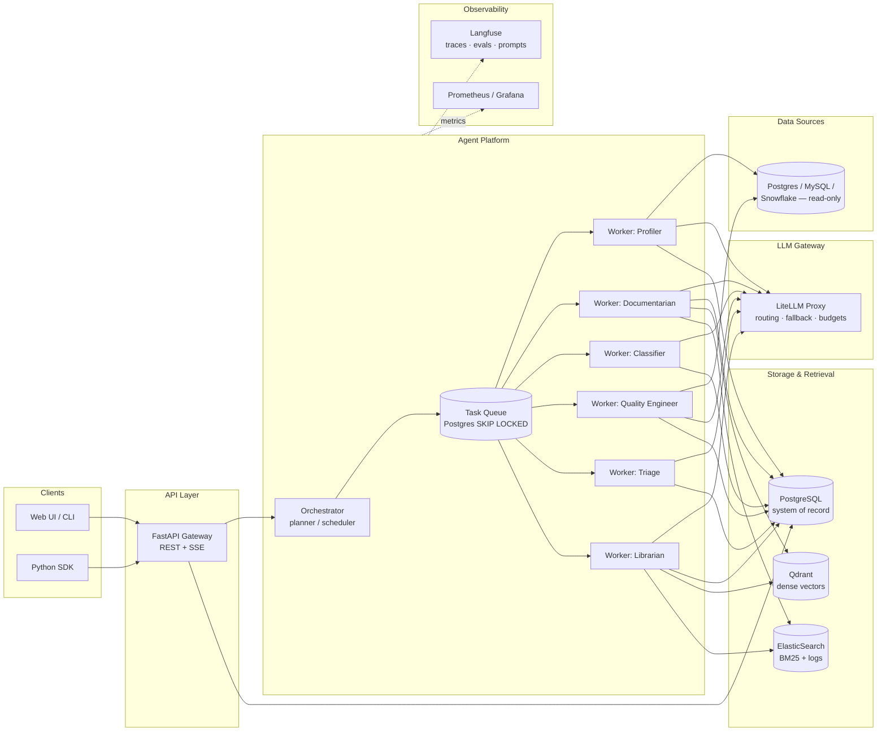

# Steward — Technical Specification

**Version:** 0.2 · **Status:** Draft for implementation · **Last updated:** 2026-08-06

Companion documents: `ARCHITECTURE.md` (requirements, invariants, tech decisions — the authority), `GUARDRAILS.md` (fitness functions enforcing them). This spec details the component designs.

Steward is a multi-agent data management platform. It connects to an organization's databases and autonomously performs four jobs that data teams do manually today:

1. **Catalog & document** — profile every table/column and generate a living, searchable data catalog
2. **Classify** — detect and label sensitive data (PII, PHI, financial) with evidence and confidence
3. **Monitor quality** — propose, compile, and schedule data quality checks; detect schema drift and anomalies; open triaged incidents
4. **Answer** — agentic question-answering over the catalog with hybrid retrieval and citations

---

## Table of contents

1. [Goals and non-goals](#1-goals-and-non-goals)
2. [System architecture](#2-system-architecture)
3. [Agent runtime and orchestration](#3-agent-runtime-and-orchestration)
4. [The agents](#4-the-agents)
5. [Retrieval subsystem](#5-retrieval-subsystem)
6. [LLM gateway](#6-llm-gateway)
7. [Data model](#7-data-model)
8. [API surface](#8-api-surface)
9. [Evaluation framework](#9-evaluation-framework)
10. [Observability](#10-observability)
11. [Deployment and delivery](#11-deployment-and-delivery)
12. [Roadmap](#12-roadmap)
13. [Key design decisions](#13-key-design-decisions)

---

## 1. Goals and non-goals

### Goals

- **G1 — Autonomous stewardship.** Given a database connection, the system produces and maintains a documented, classified catalog with no human authoring required (humans review and approve, they don't write).
- **G2 — Trustworthy answers.** Natural-language questions about the data estate are answered with citations to catalog entries and live metadata, never from the model's parametric memory alone.
- **G3 — Measurable quality.** Every LLM-dependent behavior (documentation, classification, retrieval, answering, triage) has an offline eval suite with golden data, and CI blocks regressions.
- **G4 — Production discipline.** Typed tool contracts, resumable orchestration, idempotent workers, tracing on every step, cost budgets, and GitOps delivery. The system is built to be operated, not demoed.
- **G5 — Provider independence.** Any agent can run on Anthropic, OpenAI, Qwen, or an OSS model behind vLLM by config change only, with per-task model routing.

### Non-goals

- **Not an ETL/orchestration engine.** Steward observes and manages data; it does not move it. No Airflow/Dagster replacement.
- **Not a BI tool.** The `ask` capability answers questions *about* the data estate (metadata, quality, location, lineage), and can run bounded read-only queries for evidence, but dashboarding is out of scope.
- **Not multi-tenant (v1).** Single organization per deployment. The data model is designed so tenancy can be added without schema rewrite (all root entities carry `workspace_id`).
- **Not a write path to source databases.** All source connections are read-only by construction (enforced at the connection-role level, not just application code).

---

## 2. System architecture



### Components

| Component | Responsibility |
|---|---|
| **API Gateway** | FastAPI service. REST for CRUD/queries, Server-Sent Events for streaming agent runs. AuthN via API keys (v1), OIDC (v2). All request/response bodies are Pydantic v2 models shared with the SDK. |
| **Orchestrator** | Decomposes goals ("scan this source") into task DAGs, enqueues tasks, tracks run state, handles retries/timeouts, and checkpoints progress so runs survive worker restarts. |
| **Workers** | Stateless asyncio processes that claim tasks from the queue and execute one agent loop per task. Horizontally scalable; each worker type maps to a K8s Deployment. |
| **LLM Gateway** | A LiteLLM proxy deployment. Single OpenAI-compatible endpoint for all workers; model routing, fallback chains, rate limiting, and per-run cost budgets live here, not in agent code. |
| **PostgreSQL** | System of record: sources, assets, profiles, classifications, rules, incidents, agent runs, task queue, checkpoints. |
| **Qdrant** | Dense vector index over catalog documents (asset docs, column docs, profile summaries, incident postmortems). |
| **ElasticSearch** | BM25 lexical index over the same corpus (exact identifiers like `cust_acct_id` are lexical problems, not semantic ones) plus structured agent/audit logs. |
| **Langfuse** | Every agent step emits a trace (session → run → task → generation/tool-call spans). Also hosts prompt versions and eval datasets/scores. |

### Shared libraries (monorepo packages)

The repo is a `uv` workspace with independently importable packages — the same "shared SDK across services" discipline used in platform teams:

```
packages/
  steward-schemas/     # Pydantic models: API contracts, tool I/O, events (zero heavy deps)
  steward-queue/       # Postgres task queue: migrations, transactional enqueue, SKIP LOCKED claiming, worker loop
  steward-orchestration/ # Goal registry + deterministic planners: name, input schema, planner, allowed task types, budget
  steward-catalog/     # Deterministic metadata catalog: secret resolution, read-only source inspection, convergent persistence
  steward-agents/      # Agent runtime: owned contracts (tools, budgets, results); LangGraph contained here
  steward-retrieval/   # Hybrid search client: Qdrant + ES + fusion + rerank
  steward-llm/         # Thin LiteLLM client wrapper: typed completions, structured output helpers
  steward-telemetry/   # Tracing seam: owned Tracer contract, Langfuse contained behind it
  steward-sdk/         # Public Python client for the REST API (generated types + hand-written ergonomics)
services/
  api/                 # FastAPI app
  workers/             # Worker entrypoints (one per agent type)
```

The source connector planned for `services/connectors/` landed in
`packages/steward-catalog` instead (issue #20). A connector is a library the
scan handler calls, not a process anything deploys, and putting it under
`services/` would have made a package import a service — the one direction I4
forbids. `services/` stays as it was: entrypoints only.

---

## 3. Agent runtime and orchestration

The runtime has two layers with different ownership rules (see [D1](#13-key-design-decisions)):

- **Platform layer (owned, framework-free):** task queue, scheduling, budgets, typed tool contracts, result schemas, tracing/audit policy.
- **Agent execution layer (LangGraph, contained):** the per-task stateful graph — checkpointing via LangGraph's Postgres saver, `interrupt()` for human-review gates, streaming. Confined to `packages/steward-agents` internals; no LangGraph type crosses the package boundary (enforced by S1/S2/S5).

### 3.1 Execution model: planner / worker

- A **run** is created from a goal (e.g. `scan_source(source_id)`, `answer(question)`). Goals are registered, one site each, in `steward-orchestration`: name, typed input schema, planner, allowed task types, budget policy, and a sample payload the planner is replanned against to exercise its determinism over a representative payload (issue #37). The API validates the request against that registration before a run row exists — an unknown goal or a payload the schema rejects is problem-details, not a run (issue #19); a planner that expands to zero tasks is rejected the same way, before the run exists, rather than committed as a run nothing can ever finish (issue #37).
- The **planner** (deterministic code for well-known goals; LLM-planned only for `ask` runs) expands the goal into a **task DAG**, and may only name task types its registration allows. Example for `scan_source`:

```
discover_schema ──► profile_table (×N, fan-out per table)
                        ├─► document_table
                        │       └─► index_document
                        └─► classify_columns
                                └─► propose_quality_rules
```

**That DAG is the target shape, not what `scan_source` plans today.** As shipped
(issue #20) it plans **exactly one** task — the metadata scan — and the reason is
a budget one: `RunPlan.task_specs` gives every planned task the *run's* budget,
so an N-way fan-out lets a single run spend N times the cap the API published for
it (I12). With one task the per-task cap the queue enforces *is* the run cap, so
the advertised budget is the real bound. The fan-out above lands once run-level
budget reservation does — accumulated `runs.used_*` checked against
`runs.budget_*` by the runtime, which arrives with the agent loop H4's
step/token/cost half measures (issue #37). No goal may fan out before then.

- Tasks are rows in Postgres. Workers claim them with `SELECT ... FOR UPDATE SKIP LOCKED`, giving exactly-once *claiming* with at-least-once *execution* — so **every task handler must be idempotent** (all writes are upserts keyed on natural keys; indexing uses deterministic document IDs).
- Task state machine: `pending → claimed → running → (succeeded | failed | dead)`. Failures retry with exponential backoff up to `max_attempts`; `dead` tasks page via alerting and can be replayed.

### 3.2 The agent loop

Each LLM-driven task runs a bounded tool-use loop:

```python
async def run_agent(task: Task, agent: AgentSpec, ctx: RunContext) -> TaskResult:
    graph = compile_graph(agent, ctx)     # LangGraph internals; never exposed past this package
    raw = await graph.ainvoke(
        initial_state(task),
        config=run_config(task.id, agent.limits, ctx),  # thread_id -> Postgres checkpointer,
    )                                                   # Langfuse callback, budget guards
    return TaskResult.model_validate(raw["result"])     # typed at the boundary, always
```

Budget guards, tool validation, and result typing run in *our* node wrappers around every model call and tool call — the framework executes the graph; it does not get to decide policy.

Properties the runtime guarantees:

- **Typed tools.** Every tool is a Python function with Pydantic input/output models; schemas are generated, arguments validated before execution, and validation errors are returned to the model as structured feedback (one retry) rather than crashing the run.
- **Budgets are hard.** Per-task caps on steps, tokens, dollars (via LiteLLM cost tracking), and wall-clock. Exceeding a budget fails the task with a `budget_exceeded` error — visible in traces and metrics — never a silent truncation.
- **Checkpointing.** Agent state (message history + scratchpad) is persisted after every step. A worker dying mid-run (deploy, OOM, spot eviction) costs at most one step of progress.
- **Structured results.** A task's terminal output must validate against the task type's result schema (the model is forced through a `submit_result` tool). Downstream tasks consume typed results, never prose.
- **Least-privilege toolsets.** Each agent type gets an explicit allowlist of tools. The Classifier cannot run SQL; the Profiler cannot write catalog docs.

### 3.3 Human-in-the-loop gates

Actions with governance weight — publishing PII classifications, activating proposed quality rules — enter a `pending_review` state and surface in a review queue (API + UI). Approval policies are configurable per action type: `auto` (trusted), `auto_above_confidence(x)`, or `manual`. Every auto-approval is auditable back to the policy that allowed it.

---

## 4. The agents

| Agent | Trigger | Input | Tools | Output (typed) |
|---|---|---|---|---|
| **Profiler** | scan, schedule, drift event | table ref | `run_profile_sql` (templated, read-only), `sample_rows` (masked) | `TableProfile`: row counts, per-column stats, null/distinct ratios, top values, inferred semantic types |
| **Documentarian** | new/changed profile | profile + schema + query-log excerpts | `get_related_assets`, `search_catalog`, `submit_doc` | `AssetDoc`: table summary, per-column descriptions, join keys, caveats — each claim tagged with evidence refs |
| **Classifier** | new/changed columns | column metadata + masked value samples | `submit_classification` | `ColumnClassification`: label (PII.email, PII.national_id, PHI, financial, none…), confidence, evidence spans, suggested policy tag |
| **Quality Engineer** | post-documentation, user request | profile + doc + history | `compile_rule_sql`, `dry_run_rule`, `submit_rules` | `QualityRuleSet`: declarative expectations (not-null, unique, range, freshness, referential, distribution-drift) with rationale |
| **Triage** | check failure / drift detection | failing check + profile history + recent schema changes + related incidents | `get_check_history`, `diff_schemas`, `search_incidents`, `submit_triage` | `IncidentTriage`: severity, blast-radius (downstream assets), ranked root-cause hypotheses, suggested owner |
| **Librarian** | `POST /v1/ask` | user question | `search_catalog` (hybrid), `get_asset`, `get_profile`, `run_readonly_sql` (bounded: LIMIT-enforced, cost-capped, masked), `submit_answer` | `Answer`: markdown answer with inline citations `[asset:123]`, confidence, and the retrieval trail |

Two design rules apply across all agents:

1. **Evidence or it didn't happen.** Documentarian, Classifier, and Librarian outputs must reference evidence (profile fields, sampled values, retrieved documents). Unsupported claims fail schema validation.
2. **Sensitive values never reach the model raw.** Sampling tools apply format-preserving masking (`j***@g***.com`, `4***-****-****-1234`) before values enter a prompt; classification works from formats, names, and statistics, not raw payloads.

---

## 5. Retrieval subsystem

The catalog corpus (asset docs, column docs, profile summaries, quality rules, incident postmortems) is indexed twice and searched once.

### 5.1 Indexing pipeline

- **Chunking:** documents are chunked structurally (a column doc is one chunk; a table doc chunks by section), never by fixed token windows — catalog documents have meaningful structure, and chunk boundaries should follow it.
- **Dense:** embeddings via the LLM gateway (default `text-embedding-3-large`; configurable to OSS embedders, e.g. `bge-m3`, served by the same vLLM deployment). Stored in Qdrant with payload filters: `asset_type`, `source_id`, `sensitivity`, `updated_at`.
- **Lexical:** the same chunks go to ElasticSearch with custom analyzers that preserve identifiers (`cust_acct_id` tokenizes to `cust_acct_id`, `cust`, `acct`, `id`) — users search by exact column names as often as by meaning.
- **Consistency:** indexing is an orchestrated task downstream of doc generation with deterministic doc IDs, so re-runs converge. A nightly reconciliation job diffs Postgres (truth) against both indexes and repairs drift.

### 5.2 Query pipeline

```
question ──► query analysis ──► parallel: Qdrant top-40 (filtered)
                    │                     ES BM25 top-40 (filtered)
                    │                        │
                    └────────► RRF fusion ◄──┘
                                   │
                            cross-encoder rerank → top-8
                                   │
                            context assembly (dedup by asset, freshness-boosted)
```

- **Query analysis** (small/fast model): extracts filters (source, sensitivity, asset type) and rewrites the question into one semantic query + zero or more lexical identifier queries.
- **Fusion:** reciprocal-rank fusion (k=60) — robust to score-scale mismatch between engines, no tuning burden.
- **Rerank:** cross-encoder (hosted reranker or OSS `bge-reranker-v2-m3` on vLLM) over the fused top-40.
- **Agentic search:** the Librarian doesn't get one shot. It can reformulate and re-search, drill into specific assets, and run bounded verification SQL — the retrieval trail is captured in the trace and returned with the answer.

### 5.3 Retrieval quality targets (eval-gated, see §9)

| Metric | Target |
|---|---|
| Recall@8 (golden query set) | ≥ 0.90 |
| MRR@8 | ≥ 0.75 |
| P95 search latency (no rerank / with rerank) | ≤ 150 ms / ≤ 400 ms |

---

## 6. LLM gateway

All model access goes through a **LiteLLM proxy** deployment. Agent code sees one OpenAI-compatible endpoint and *model aliases*, never provider SDKs.

### Routing by task tier

| Alias | Used for | Default binding | Fallback chain |
|---|---|---|---|
| `steward-reasoning` | Documentarian, Triage, Librarian planning | `claude-sonnet-5` | → `gpt-5.x` → `qwen-max` |
| `steward-fast` | query analysis, rule compilation, extraction | `claude-haiku-4-5` | → `gpt-mini-tier` → `qwen-turbo` |
| `steward-classify` | Classifier | fine-tune-ready OSS (`qwen-7b` on vLLM) with `steward-fast` fallback | |
| `steward-embed` | embeddings | `text-embedding-3-large` | → `bge-m3` (vLLM) |

The gateway also owns: per-workspace **cost budgets** (hard caps surfaced as 429s to workers, which pause runs rather than degrade silently), **response caching** for idempotent calls (profiling summaries, embeddings), **retry/fallback** policy, and **key management**. Swapping the entire system to a different provider is a values-file change, not a code change (**G5**).

---

## 7. Data model

PostgreSQL is the single system of record. Qdrant/ES are derived indexes, rebuildable from Postgres at any time. Core entities (all tables carry `workspace_id`, timestamps; migrations via Alembic):

```
sources          — connection registrations (dsn ref → secret store, engine, scan schedule)
assets           — tables/views discovered in sources (fqn, type, lifecycle: active|missing|deprecated)
columns          — per-asset columns (name, type, ordinal, nullable)
profiles         — versioned TableProfile JSONB per asset (append-only; latest pointer)
documents        — versioned catalog docs (asset/column level, markdown + evidence refs, review state)
classifications  — column sensitivity labels (label, confidence, evidence, review state, policy tag)
quality_rules    — declarative expectations (type, params, compiled SQL, state: proposed|active|muted)
check_runs       — rule execution results (pass/fail, observed values, duration)
incidents        — opened from failures/drift (severity, status, triage JSONB, links to check_runs)
runs             — agent run records (goal, payload, status, budget + usage, langfuse trace id, idempotency key)
tasks            — the queue (run_id, type, payload JSONB, state, attempts, claimed_by, …)
checkpoints      — agent state snapshots (task_id, step, state JSONB)
audit_log        — every state-changing action (actor: human|agent|policy, before/after)
```

The catalog half of that list landed with issue #20 and carries three schema-level
guarantees worth naming. `sources` is unique on (workspace, engine, host,
database, schema filter), `assets` on (source, schema, name) and `columns` on
(asset, name), so re-registering a source or rescanning a database converges on
the existing row rather than duplicating it (I8). `sources.dsn_secret_ref` has a
CHECK admitting `scheme:name` references only — every DSN shape fails it — so a
credential cannot be written to the database at all (N7). And there is no
`last_seen_at`: a timestamp touched by every scan would make "a rescan with no
upstream change leaves byte-identical state" false by construction. What was
seen when is what `audit_log` records.

Notable choices: profiles and documents are **append-only versioned** (stewardship history is a feature — "what did this table look like in March?"); the task queue lives in Postgres rather than a broker (see [D2](#13-key-design-decisions)); `audit_log` is written from the same transactions as the mutations they record; `runs.trace_id` is `NOT NULL` and `runs.idempotency_key` is uniquely indexed, so an untraceable run and a duplicated `POST /v1/runs` are both unrepresentable rather than merely discouraged.

---

## 8. API surface

REST, versioned under `/v1`, OpenAPI-first (the spec is generated from code and published; the SDK's types are generated from the spec — one source of truth).

```
# Sources & scanning
POST   /v1/sources                       # register a source (read-only DSN)
POST   /v1/sources/{id}/scan             # start a scan run → 202 + run_id
GET    /v1/sources/{id}/assets

# Catalog
GET    /v1/assets?query=&source=&sensitivity=
GET    /v1/assets/{id}                   # doc + profile + classifications + rules
GET    /v1/assets/{id}/history

# Search & ask
POST   /v1/search                        # hybrid retrieval, returns ranked chunks + scores
POST   /v1/ask                           # agentic QA; SSE stream: retrieval events → tokens → citations

# Quality
GET    /v1/quality/rules?asset_id=&state=
POST   /v1/quality/rules/{id}:activate | :mute
GET    /v1/incidents?status=&severity=
POST   /v1/incidents/{id}:resolve

# Review queue (human-in-the-loop)
GET    /v1/reviews?type=classification|document|rule
POST   /v1/reviews/{id}:approve | :reject     # rejection requires a reason → becomes eval data

# Runs & operations
POST   /v1/runs                          # M0 skeleton: generic goal-based run creation → 202 + run_id
GET    /v1/runs/{id}                     # status, task tree, cost, trace link
POST   /v1/runs/{id}:cancel
```

`POST /v1/sources` is idempotent on the source's natural key and answers 201 the
first time, 200 on a repeat, so a client can tell whether it created anything
without a second request. `POST /v1/sources/{id}/scan` answers 202 either way:
if a scan of that source is already pending or running it returns that run
rather than starting a second, decided under a transaction-scoped advisory lock
so two simultaneous requests serialise instead of both starting one.
`GET /v1/assets` pages by opaque cursor over `(schema, name, id)` — a total
order, so a scan committing between two pages cannot make a client skip an asset.

`POST /v1/runs` is M0's entry point: a generic `{goal, payload}` body returning 202. The run row and the tasks its goal plans are written in one transaction (I8), so a 202 is a guarantee that work is queued, not a promise to queue it later; a worker then executes the task and the run's status follows its tasks (`pending → running → succeeded|failed`) in the transaction that settles the last one. The expansion is the goal registry's (§3.1): the endpoint validates `goal` and `payload` against the registration and rejects anything unregistered or schema-invalid with problem details before a run exists (#19). Goal-specific endpoints (`POST /v1/sources/{id}/scan`, above) land in M1 and are expected to become the primary way runs get created; whether `POST /v1/runs` stays as a generic escape hatch or narrows to goal-specific endpoints only is an open question for that milestone.

The published run contract is a **projection**, not the row: `Run` (id, goal, payload, status, trace id, budget, usage, timestamps) is built from the `runs` record by the API service, so storage can change without that being an API change (I3, N9). Every run carries a Langfuse trace id from creation, generated locally and stored on the row whether or not tracing credentials are configured — so a run is always correlatable and no deployment depends on an observability account to function (I7).

Conventions: cursor pagination everywhere; RFC 9457 problem-details errors; idempotency keys on all POSTs that create runs — replayed with the same body they return the original run, replayed with a different one they are a `409`, because returning the original would tell a client its edited request was queued when nothing will ever run it; SSE (not WebSockets) for streaming — it's proxy-friendly and resumable via `Last-Event-ID`.

**Rejections are eval data:** every human rejection in the review queue (with reason) is exported to a Langfuse dataset, closing the loop between production feedback and offline evals.

---

## 9. Evaluation framework

The eval framework is a first-class subsystem, not an afterthought: **no prompt, model binding, or retrieval parameter changes ship without passing the eval gate in CI.**

### 9.1 Eval suites

| Suite | Dataset | Method | Gate |
|---|---|---|---|
| **Retrieval** | ~200 golden queries → relevant asset IDs (seeded from synthetic questions over a fixture warehouse, grown from real `ask` traffic) | deterministic: recall@k, MRR, nDCG | recall@8 ≥ 0.90, no metric drops > 2 pts vs `main` |
| **Classification** | labeled fixture columns (each sensitivity type × tricky negatives: `ssn_hash`, `email_domain`, test data) | deterministic: precision/recall per label | PII recall ≥ 0.95, precision ≥ 0.90 |
| **Documentation** | fixture tables with reference docs | LLM-as-judge, rubric-scored (accuracy, completeness, evidence-grounding, concision), judge calibrated against a human-scored subset (target: Cohen's κ ≥ 0.7, recalibrate when it drifts) | mean ≥ 4.0/5, zero ungrounded-claim flags |
| **Answering** | golden Q&A pairs over the fixture warehouse | faithfulness (every claim cites retrieved evidence — judge-scored) + answer correctness | faithfulness ≥ 0.95 |
| **Triage** | replayed historical incidents with known root causes | root-cause hit@3, severity agreement | hit@3 ≥ 0.8 |
| **Agent efficiency** | all suites | steps, tokens, cost per task | cost per task ≤ 1.2× baseline |

### 9.2 Mechanics

- Datasets and scores live in **Langfuse**; runs execute via `steward evals run <suite>` against a Dockerized fixture warehouse (deterministic seed data), so evals run identically on a laptop and in CI.
- **CI gate:** PRs touching prompts, agent specs, retrieval config, or model bindings trigger the affected suites in GitHub Actions; results are posted as a PR comment with per-metric deltas vs `main`.
- **Online:** sampled production runs (10%) are judge-scored asynchronously; scores land in Langfuse and Prometheus, alerting on degradation — the canary for silent model-behavior changes.

---

## 10. Observability

Three layers, distinct jobs:

1. **Langfuse — semantic tracing.** Every run is a trace; every task, generation, and tool call is a span with model, tokens, cost, latency, and validated I/O. Prompt versions are managed in Langfuse, so any output links to the exact prompt version that produced it. Answering "why did the Classifier call this column PHI?" is a trace lookup, not archaeology. Langfuse is reached only through `steward-telemetry`'s owned `Tracer` contract (the same containment pattern as LangGraph and LiteLLM), and the trace id is generated locally: with no credentials configured the system runs unchanged and only span export is missing.
2. **OpenTelemetry + Prometheus/Grafana — service health.** RED metrics for the API, queue depth/age per task type, worker saturation, per-alias LLM latency/error/fallback rates, cost per workspace per day. SLOs: API P99 < 500 ms (non-agent endpoints); scan completes < 30 min for a 500-table source; `ask` P50 < 10 s.
3. **ElasticSearch — structured logs.** JSON logs correlated by `run_id`/`task_id`/`trace_id`, searchable next to the audit trail.

Alerting is defined in code (Prometheus rules in the Helm chart): dead tasks, queue age > 10 min, eval-score degradation, budget-cap hits, fallback-chain activation, index-reconciliation drift.

---

## 11. Deployment and delivery

### Runtime topology (Kubernetes)

- `api` Deployment (HPA on CPU/RPS) · one Deployment per worker type (HPA on queue depth via KEDA-style custom metric) · `litellm` Deployment · CronJobs for scheduled scans, check execution, and index reconciliation.
- Postgres/Qdrant/ES via operators or managed services (values-file choice); Langfuse self-hosted in-cluster or cloud.
- Config via Helm values; secrets via ExternalSecrets (source DSNs and provider keys never in git); NetworkPolicies restrict workers so only connector pods can reach data sources.

### CI/CD

- **CI (GitHub Actions):** lint (`ruff`), types (`mypy --strict` on `packages/` and `services/`), tests (`pytest`, unit + integration against Dockerized Postgres/Qdrant/ES), eval gates (§9), image build/scan, Helm chart lint. Trunk-based; merge queue.
- **CD (ArgoCD):** GitOps repo holds environment overlays (`dev` → `staging` → `prod`). CI bumps image tags in `dev` automatically; promotion is a PR between overlay directories. Argo Rollouts canaries the API (10% → analysis against error-rate/latency metrics → 100%); prompt/model-binding changes ride the same pipeline as code — **a bad prompt is rolled back exactly like a bad image**.

---

## 12. Roadmap

| Milestone | Scope | Exit criterion |
|---|---|---|
| **M0 — Skeleton** | uv workspace, schemas package, FastAPI app, Postgres migrations, task queue + worker loop (no LLM), CI green | a no-op run flows API → queue → worker → done under **end-to-end trace correlation**: one trace id, generated locally and stored NOT NULL, carried from the POST response through every span and audit row. Verifying that Langfuse *received* a resolvable trace is H6, and lands with the M1 agent loop — M0 deliberately runs credential-free |
| **M1 — Catalog** | Postgres connector, Profiler, Documentarian, Classifier; review queue; audit log | scan of the fixture warehouse (100+ tables) yields reviewed docs + classifications |
| **M2 — Search** | indexing pipeline, hybrid retrieval, `/v1/search`; retrieval eval suite gating CI | retrieval targets met on golden set |
| **M3 — Ask** | Librarian agent, SSE streaming, citations; answering eval suite | faithfulness ≥ 0.95 on golden Q&A |
| **M4 — Quality** | Quality Engineer, rule compiler/scheduler, drift detection, Triage, incidents | injected data faults in fixtures are detected and correctly triaged |
| **M5 — Hardening** | budgets, checkpointing under chaos testing (kill workers mid-run), online eval sampling, dashboards, alerting | chaos suite passes; SLO dashboards live |
| **M6 — Delivery** | Helm chart, ArgoCD overlays, canary rollouts, load test (500-table scan; 50 concurrent asks) | one-command deploy to a fresh cluster meets SLOs |

Post-v1 candidates: lineage extraction from query logs, dbt/warehouse-native connectors (Snowflake, BigQuery), knowledge-graph layer over the catalog, MCP server exposing Steward tools to external agents, multi-tenancy.

---

## 13. Key design decisions

**D1 — LangGraph for agent execution, contained behind an owned contract.**
The runtime splits into two layers with different ownership rules. **Agent execution** — the stateful graph, checkpointing, interrupt/resume, streaming — runs on LangGraph: its Postgres checkpointer aligns with I1, `interrupt()` maps directly to our human-review gates, Langfuse integrates natively, and rebuilding durable execution is weeks of undifferentiated work. **The platform contract** — typed tools, budgets, task claiming, result schemas, tracing policy — is ours and framework-free. Containment is mechanical, not aspirational: `langgraph` imports are allowed only inside `packages/steward-agents` (S1), and no LangGraph type appears in that package's public API (S5) — callers see our Pydantic contracts only. If LangGraph churns or a better substrate appears, the blast radius is one package's internals.
Rejected: *fully custom runtime* — re-derives checkpointing/interrupts/streaming for no differentiating value, and an unfinished runtime is worse than a contained dependency; *whole-hog LangChain adoption* (chains, community integrations threaded through business code) — that coupling is exactly what I9 exists to prevent; *CrewAI/AutoGen-style frameworks* — opinionated multi-agent abstractions that would own our orchestration semantics instead of the reverse. (LiteLLM in `steward-llm` follows the same containment pattern for providers.)

**D2 — Postgres as the task queue (SKIP LOCKED), not Redis/RabbitMQ/Kafka.**
Task throughput is modest (thousands/hour, not millions/sec); what matters is **transactional enqueue** — a task and the state change that caused it commit atomically, eliminating a whole class of ghost-task/lost-task bugs. One fewer stateful system to operate. The queue interface is abstracted so a broker can replace it if throughput ever demands.

**D3 — Hybrid retrieval from day one, not dense-only.**
Data-estate search is bimodal: "where is churn data?" is semantic; `cust_acct_id` is lexical. Dense-only retrieval measurably fails the second mode. RRF fusion is scale-free and tuning-free, and ElasticSearch is already in the stack for logs.

**D4 — Evidence-required outputs, enforced by schema.**
Hallucinated column descriptions are worse than none — they erode the trust the whole product depends on. Requiring evidence references in the output schema (validation-enforced, judge-audited) turns "the model shouldn't make things up" from a hope into a contract.

**D5 — SQL access is templated for agents, free-form only for the Librarian — and always bounded.**
Profiler/Quality agents execute *parameterized templates* (no injection surface, predictable cost). Only the Librarian composes SQL, and only through a tool that enforces read-only role, `LIMIT`, statement timeout, cost estimation, and value masking. Capability, then containment.

**D6 — Prompts are deployable artifacts.**
Prompts are versioned in Langfuse, referenced by version in config, changed via PR, gated by evals, and rolled back via ArgoCD like any binary. "Someone edited the prompt in prod" must be structurally impossible.
